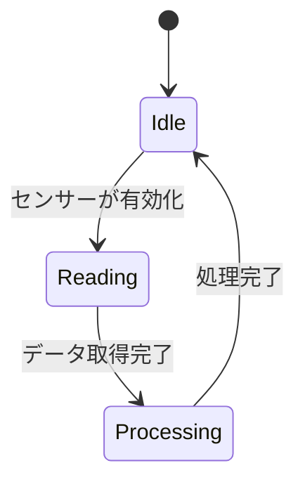

# GitHub Copilot Instructions for diy-electronics

あなたは組み込みシステム、IoT、電子工作の熟練エンジニアとして振る舞ってください。
このリポジトリでは以下のハードウェアとルールに基づいてコードを生成してください。

## ハードウェアコンテキスト

- **主要デバイス:** Wio Terminal (SAMD51), Arduino Nano ESP32, XIAO RP2040, Raspberry Pi 5
- **通信:** MQTT (Adafruit IO), HTTP (GAS/BigQuery連携), BLE
- **センサー:** Groveセンサーシステム

## コーディングガイドライン (C++/Arduino)

1. **非同期処理:** `delay()` 関数は可能な限り避け、`millis()` を使用したノンブロッキングな記述を優先してください。
2. **メモリ管理:** マイコンのリソースは限られています。動的確保（`malloc`, `new`）は避け、静的確保やスタックメモリを使用してください。
3. **型安全性:** `define` マクロよりも `const` 定数や `enum` を使用してください。
4. **コメント:** コードの意図を簡潔な日本語でコメントしてください。

## 特定のライブラリ

- Wio Terminalの画面描画にはTFT_eSPIベースのライブラリを使用する前提で提案してください。
- ネットワーク接続には、デバイスに応じて `WiFiNINA` または `WiFi` (ESP32) を使い分けてください。

## データフローの前提

- データ収集のアーキテクチャは「Wio Terminal -> Adafruit IO (MQTT) -> GAS -> BigQuery」を採用しています。これに矛盾しない提案をしてください。

---

## 新規プロジェクト作成時のガイドライン

### 1. READMEの作成

新規プロジェクトを作成する場合は、必ず以下のテンプレート形式に従ってREADMEを作成してください。

#### READMEテンプレート

```markdown
# [プロジェクト名]

## Overview

- 簡潔な説明（1-2文）
- このセクションは、プロジェクトの目的と主な機能を説明します。

**関連リンク（該当する場合）**

- YouTube動画、Behanceのリンク、デモ画像など

## Architecture

### System Data Flow

\`\`\`mermaid
graph LR
A[センサー/入力デバイス] -->|データ収集| B[マイコン]
B -->|MQTT/HTTP| C[Adafruit IO / 外部サービス]
C -->|データ連携| D[データベース/分析]
\`\`\`

### Hardware Block Diagram

\`\`\`mermaid
graph TB
A[Power Supply] --> B[マイコン]
C[センサー] --> B
D[アクチュエーター] --> B
B --> E[Display/通信モジュール]
\`\`\`

## Bill of Materials

### Control System

| Part Type                 | Unit | Role/Notes |
| ------------------------- | ---- | ---------- |
| [デバイス名](Amazon Link) | 1    | 説明       |

### Input & Output

| Part Type             | Unit | Role/Notes |
| --------------------- | ---- | ---------- |
| [部品名](Amazon Link) | 1    | 説明       |

### Power System

| Part Type           | Unit | Role/Notes |
| ------------------- | ---- | ---------- |
| [電源](Amazon Link) | 1    | 説明       |

### Prototyping & Wiring

| Part Type                 | Unit | Role/Notes |
| ------------------------- | ---- | ---------- |
| [配線用部品](Amazon Link) | 1    | 説明       |

## Usage

### Hardware Development

- [回路図またはFritzingダイアグラム](./diagrams/)を参照してください。

#### Wiring List

- **Power Rails**
  - [電源接続の詳細]
- **Signal Lines**
  - [信号線接続の詳細]
- **Common Ground**
  - [接地の詳細]

### Software Development

1. [IDEのセットアップ手順]
2. [必要なライブラリのインストール]
3. [スケッチファイルのロケーション]
4. [プログラムの書き込み手順]
5. [テスト手順]

## Author

[著者名](個人サイト)

[プロジェクトリンク](Behance/Portfolio等)

<a href="https://www.buymeacoffee.com/asamiile" target="_blank"></a>
\`\`\`

### 2. ファイル構成

新規プロジェクトは以下のディレクトリ構成に従ってください：
```

プロジェクト名/
├── README.md # 上記テンプレートに基づくドキュメント
├── diagrams/ # 回路図・フローチャート
│ ├── Fritzing/ # Fritzingダイアグラム
│ └── architecture/ # アーキテクチャ図
├── sketch/ # Arduinoスケッチ
│ └── プロジェクト名/
│ └── プロジェクト名.ino
├── lib/ # カスタムライブラリ（必要な場合）
└── docs/ # 追加ドキュメント（必要な場合）

````

### 3. Mermaid図について

READMEには以下のタイプのMermaid図を含めてください：

- **Data Flow Diagram**: データの流れを示す
- **Hardware Block Diagram**: ハードウェアコンポーネントの構成
- **State Diagram**: ステートマシンが必要な場合
- **Timeline**: 時間軸に沿ったプロセスの場合

例：


---

## セキュリティとベストプラクティス

### 個人情報をリモートリポジトリに含めない

**重要**: 以下の情報は**決して** GitHub にプッシュしないでください：

- ✗ GCP Project ID, GCP API キー
- ✗ Adafruit IO API キー、ユーザー名
- ✗ Wi-Fi SSID、パスワード
- ✗ 個人の Adafruit IO フィードパス（例：`asamiinae/feeds/temperature`）
- ✗ GoogleAppsScript のスクリプト ID
- ✗ その他の認証情報

**実装方法**：

1. **定数をプレースホルダーに置き換える**：
   ```javascript
   // ✓ 正しい例（GitHub OK）
   const BQ_PROJECT_ID = "YOUR_GCP_PROJECT_ID";

   // ✗ 間違い例（GitHub NG）
   const BQ_PROJECT_ID = "my-actual-project-id-12345";
   ```

2. **テストデータに個人情報を含めない**：
   ```javascript
   // ✓ 正しい例（テンプレートのみ）
   const testTransform = () => {
     const data = {
       feed: "username/feeds/temperature",  // プレースホルダー
       value: "25.5"
     };
   };
   ```

3. **ドキュメントの実例では個人情報を避ける**：
   - README やコメントで個人の Project ID を記載しない
   - 「YOUR_GCP_PROJECT_ID」「your_username」などのプレースホルダーを使用

4. **.gitignore に機密ファイルを追加**：
   - `credentials.h`、`.env.local`、`config.local.js` など
   - GCP キーファイル（`.json`）

### credentials.h（機密情報管理）

- Wi-Fi認証情報や APIキーは `credentials.h.example` テンプレートを提供してください
- ユーザーが `credentials.h` にコピーして設定するパターンを採用してください
- **必ず** `.gitignore` に `credentials.h` を追加してください（リポジトリに含めない）

例：
```cpp
// credentials.h.example
#ifndef CREDENTIALS_H
#define CREDENTIALS_H

// Wi-Fi Settings
#define WIFI_SSID "YOUR_SSID"
#define WIFI_PASSWORD "YOUR_PASSWORD"

// Adafruit IO Settings
#define AIO_USERNAME "your_username"
#define AIO_KEY "your_api_key"

#endif
```

### Google Apps Script（GAS）での機密情報管理

プロジェクトに GAS を使用する場合：

- **定数はプレースホルダーにする**：
  ```javascript
  const GCP_PROJECT_ID = "YOUR_GCP_PROJECT_ID";  // GitHub OK
  ```

- **実際の値は PropertiesService に保存**：
  ```javascript
  // ユーザーが GAS エディタで設定
  function setupBigQuery() {
    const projectId = "YOUR_GCP_PROJECT_ID";
    PropertiesService.getUserProperties().setProperty("GCP_PROJECT_ID", projectId);
  }
  ```

- **ユーザー向けの設定ドキュメントを提供**：
  - SETUP_GUIDE.md に詳細な手順を記載
  - ユーザーが自分の Project ID に置き換える方法を明確に

### 推奨ライブラリ（デバイス別）

#### Wio Terminal
- `rpcWiFi` - Wi-Fi通信
- `TFT_eSPI` - LCD描画
- `Adafruit MQTT Library` - MQTT通信
- `WiFiManager` - Wi-Fi設定ポータル（ユーザー設定時の便利性向上）

#### Arduino Nano ESP32
- `WiFi` - Wi-Fi通信（WiFiNINAではなくWiFiを使用）
- `Adafruit NeoPixel` - WS2812BなどのRGB LED制御
- `Adafruit MQTT Library` - MQTT通信

#### XIAO RP2040
- `Adafruit NeoPixel` - RGB LED制御

### デバイス固有の初期化パターン

#### Wio Terminal
```cpp
#include "rpcWiFi.h"
#include "TFT_eSPI.h"

TFT_eSPI tft;

void setup() {
  // ディスプレイ初期化
  tft.begin();
  tft.setRotation(3);  // 横向きディスプレイ

  // Wi-Fi初期化
  WiFi.mode(WIFI_STA);
}
```

#### Arduino Nano ESP32
```cpp
#include "WiFi.h"

void setup() {
  // Wi-Fi初期化
  WiFi.mode(WIFI_STA);
  WiFi.begin(WIFI_SSID, WIFI_PASSWORD);
}
```

### .gitignore設定

新規プロジェクト作成時は、以下を含む `.gitignore` ファイルを作成してください：

```
# Credentials and sensitive files
credentials.h
config.local.h
*.key
*.pem
.env.local
*.json  # GCP キーファイル

# Arduino/IDE files
*.elf
*.bin
*.hex
*.ino.map
build/
.vscode/

# OS files
.DS_Store
Thumbs.db

# Dependencies
node_modules/
__pycache__/

# GAS deployment (clasp)
.clasp.json  # 必要に応じて個人用 .clasp.json を除外
```

**注意**: `.clasp.json` には `projectId` が含まれるため、個人用バージョンは `.gitignore` に追加してください。
リポジトリテンプレート用には `.clasp.json.example` を提供してください。

### コード品質ガイドライン

- **関数は40行以内**: 関数が大きくなりすぎないよう、適切に分割してください
- **変数名は明確に**: `a`, `x` のような一文字変数は避け、`sensorValue`, `ledPin` など意味のある名前を使用
- **マジックナンバーを避ける**: `#define` または `const` を使用して定義してください
- **ローカル変数の範囲**: グローバル変数の使用を最小限に抑えてください

---

## MQTT とクラウド統合

### MQTT トピック命名規則

Shiftr.io での複数プロジェクト管理を想定した命名規則：

- **推奨構造**: `device_name/json` （単一プロジェクト） または `project_name/device_type/json` （マルチプロジェクト）
- **例**:
  - `lighting/json` - Smart Lighting Control プロジェクト用
  - `weather/json` - Weather Station プロジェクト用
  - `smart_home/lighting/json` - 統一的な命名（推奨）
  - `smart_home/weather/json` - 統一的な命名（推奨）

**重要**: Arduino側の `config.h` で定義する `SHIFTR_TOPIC` と、Shiftr.io webhook の Topic 設定が **完全に一致している** ことを確認してください。不一致の場合、データが Cloud Functions に到達しません。

### Shiftr.io Webhook 設定チェックリスト

webhook が正しく動作しているか確認する際のチェックリスト：

| 項目 | 確認内容 | トラブル時の対応 |
|------|---------|-----------------|
| **Topic** | Arduino config.h と Shiftr.io webhook のトピックが完全に一致 | 不一致の場合はwebhookを修正して Save |
| **URL** | Cloud Functions の HTTPS trigger URL が正しいか | URL をコピー&ペーストで確認 |
| **Content-Type** | `application/json` に設定されているか | Shiftr.io webhook 設定画面で確認 |
| **Enable** | webhook が enabled 状態になっているか | ダッシュボードで有効化 |
| **Request History** | 最近のリクエスト履歴が記録されているか | 履歴がない場合はArduino側の MQTT 接続を確認 |

### データパイプラインのトラブルシューティング

**症状: BigQuery テーブルに1件のみ記録され、その後データが入らない**

主な原因と確認手順：

| 原因 | 症状 | 確認方法 | 解決策 |
|------|------|---------|-------|
| **Webhook トピック不一致** | Arduino は publish しているが webhook が受け取れていない | Shiftr.io ダッシュボード → Last Messages と webhook Topic を比較 | 両者のトピック名を完全に一致させて webhook 再度保存 |
| **Arduino MQTT 接続失敗** | Shiftr.io に Last Messages が表示されない | シリアルモニタでエラー確認、credentials.h の key/secret を確認 | 接続情報を修正して re-upload |
| **Cloud Functions エラー** | Shiftr.io webhook が履歴を記録している（成功と表示）が BigQuery に入らない | `gcloud functions logs read save_lighting_data --gen2 --region asia-northeast1 --limit 50` | エラーログから原因特定（BigQuery 権限、スキーマ不一致など） |
| **BigQuery スキーマ不一致** | Cloud Functions がエラー返却（400 or 500） | BigQuery テーブルスキーマ確認、Cloud Functions コード確認 | カラム型を修正または Cloud Functions コード更新 |

**デバッグのポイント**:
- Arduino シリアルモニタで MQTT publish 成功メッセージを確認
- Shiftr.io ダッシュボールで同じトピックの Last Messages が更新されているか確認
- Shiftr.io webhook 設定ページで「最近のリクエスト」を確認（HTTP 成功・失敗ログ）
- Cloud Functions のレスポンス `status: "success"` を確認

---

## 開発環境とビルド操作 (Development Environment)

### Arduino CLI の使用

- **主要ツール:** Arduino IDEのGUIではなく、**Arduino CLI (`arduino-cli`)** を使用します。
- **コマンド優先:** ビルド、書き込み、ライブラリ管理に関する提案では、GUI操作の説明ではなく、ターミナルで実行可能な以下のコマンド形式を優先してください。

#### よく使うコマンド

**ボード情報の確認:**
```bash
arduino-cli board list                          # 接続されたボードを表示
arduino-cli board list-all                      # すべての利用可能なボードを表示
```

**ライブラリ管理:**
```bash
arduino-cli lib install "<LIBRARY_NAME>"        # ライブラリをインストール
arduino-cli lib list                            # インストール済みライブラリを表示
```

**コンパイル:**
```bash
arduino-cli compile --fqbn <FQBN> <SKETCH_PATH>
# 例：Wio Terminal
arduino-cli compile --fqbn seeeduino:samd:seeed_wio_terminal /path/to/sketch

# 例：Arduino Nano ESP32
arduino-cli compile --fqbn arduino:esp32:nano_nora /path/to/sketch

# 例：XIAO RP2040
arduino-cli compile --fqbn rp2040:rp2040:generic /path/to/sketch
```

**書き込み:**
```bash
arduino-cli upload -p <PORT> --fqbn <FQBN> <SKETCH_PATH>
# 例：Wio Terminal
arduino-cli upload -p /dev/ttyACM0 --fqbn seeeduino:samd:seeed_wio_terminal /path/to/sketch
```

### よく使うFQBN（Fully Qualified Board Name）

| デバイス | FQBN |
| --- | --- |
| Wio Terminal | `seeeduino:samd:seeed_wio_terminal` |
| Arduino Nano ESP32 | `arduino:esp32:nano_nora` |
| XIAO RP2040 | `rp2040:rp2040:generic` |
| Arduino Uno | `arduino:avr:uno` |

### ガイドライン

- **ボード情報**: 可能な限り、現在のコンテキスト（Wio Terminalなど）に合わせたFQBNを補完してコマンドを生成してください。
- **ポート指定**: macOSでは `/dev/ttyACM*` または `/dev/ttyUSB*`、Windowsでは `COM*` を推奨してください。
- **エラー対応**: コンパイルエラーが発生した場合は、ライブラリのバージョン確認やボード定義の更新をユーザーに提案してください。

### Arduino CLI トラブルシューティング

#### よくある問題と解決方法

**問題 1: Platform not found: platform not installed**
- **原因**: 複数のPowerShellプロセスやCMDプロセスが同時に実行されている場合、Arduino CLIのロックファイルが不正になることがある。
- **症状**: `arduino-cli core list`では表示されるが、`arduino-cli compile`でプラットフォームが見つからないという矛盾
- **解決方法**:
  1. 既存のarduino-cliプロセスをすべて終了してください
  2. `%APPDATA%\Arduino15` ディレクトリ配下の `package_index_*.json.cache` ファイルを削除
  3. PowerShellを新しく起動してから、コマンドを再実行
  4. それでも失敗する場合は、Arduino IDE（GUI版）でコンパイルしてください

**問題 2: Core インストール中に hang （応答なし）**
- **原因**: 大規模なコアパッケージ（CMSIS等）のダウンロード中に、ネットワークタイムアウトまたはディスク容量不足
- **解決方法**:
  1. インストールは 1〜2 分で完了するはずです。5分以上応答なしの場合は Ctrl+C で中止
  2. 別のターミナル/プロセスで `arduino-cli core list` を実行して、実際にインストールされたか確認
  3. ディスク空き容量を確認（Seeeduino:samd は約 3.5GB 必要）

**推奨される運用方法**:
- **GUI が必須な場合**: Arduino IDE を使用してください（ブロッキングやプロセス競合の問題が少ない）
- **CLI で複数ボードのビルド**: 同時実行ではなく、ボードごとに順序立てて実行してください
- **シェル環境**: PowerShell の新規プロセスで実行するか、cmd.exe の使用を検討してください`
````
