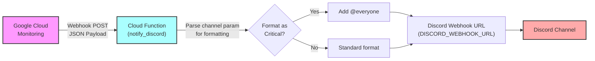

# Monitoring Alert to Discord

## Overview

Cloud Function (2nd Gen) that receives Webhook notifications from Google Cloud Monitoring and sends them to a Discord channel. The `channel` query parameter controls message formatting (e.g., adding `@everyone` for critical alerts).

**Key Features:**

- Real-time webhook notifications from Google Cloud Monitoring
- Alert level formatting (`critical`, `warning`, default)
- Prominent notifications for critical alerts (with `@everyone` mention)
- Error handling and input validation
- Scalable serverless architecture

## Architecture



## Prerequisites

### Google Cloud

- Google Cloud Project with Cloud Functions enabled
- Appropriate IAM permissions for Cloud Functions deployment
- gcloud CLI installed and configured

### Discord

- Discord Server with at least one channel
- Ability to create Webhooks in Discord

## Implementation

### Project Files

**main.py** - Cloud Function entry point

- HTTP-triggered Cloud Function for Google Cloud Monitoring webhooks
- Query parameter `channel` controls message formatting
- Single `DISCORD_WEBHOOK_URL` environment variable
- Error handling for validation and API failures

Key functions:

- `notify_discord(request)` - Main entry point
- `get_discord_webhook_url(channel)` - Retrieves Webhook URL
- `create_discord_message(payload, channel)` - Formats Discord message
- `send_to_discord(webhook_url, message)` - Sends to Discord API

**requirements.txt** - Python dependencies

```
functions-framework>=3.8.0
requests>=2.31.0
```

## Setup

### 1. Get Discord Webhook URL

Create Webhook in Discord:

1. In Discord server, select the target notification channel
2. "Channel Settings" → "Integrations" → "Webhooks"
3. "New Webhook" → Set name and copy URL

### 2. Deploy Cloud Function

```bash
# Set up authentication (first time only)
gcloud auth login

# Set your GCP project
gcloud config set project YOUR_GCP_PROJECT_ID

# Deploy the function
gcloud functions deploy notify_discord \
  --gen2 \
  --region asia-northeast1 \
  --runtime python312 \
  --source . \
  --entry-point notify_discord \
  --trigger-http \
  --allow-unauthenticated \
  --memory 256MB \
  --timeout 60s \
  --set-env-vars DISCORD_WEBHOOK_URL="YOUR_DISCORD_WEBHOOK_URL"
```

Copy the deployed function **Trigger URL** from the output.

### 3. Local Testing (Optional)

Before deploying, test locally:

```bash
# Create virtual environment
python -m venv monitoring-env

# Activate virtual environment
monitoring-env\Scripts\activate.bat  # Windows cmd
# or
.\monitoring-env\Scripts\Activate.ps1  # Windows PowerShell

# Install dependencies
pip install -r requirements.txt

# Start local server
functions-framework --target notify_discord --debug --port 8080
```

Send test request from another terminal:

```bash
# Critical channel test
curl -X POST http://localhost:8080?channel=critical ^
  -H "Content-Type: application/json" ^
  -d "{\"incident\": {\"summary\": \"Test Alert\", \"state\": \"OPEN\", \"url\": \"https://console.cloud.google.com/\"}}"
```

Expected response: `{"error": "Discord Webhook URL not configured..."}` (until webhook is set)

## Testing

### Test Cloud Function Deployment

```bash
# Send test request to deployed function
curl -X POST https://YOUR_REGION-YOUR_PROJECT_ID.cloudfunctions.net/notify_discord?channel=critical \
  -H "Content-Type: application/json" \
  -d '{
    "incident": {
      "summary": "Test Alert",
      "state": "OPEN",
      "url": "https://console.cloud.google.com/"
    }
  }'
```

Expected response: `{"status": "success"}`

Verify Discord channel receives notification.

## Operational Commands

### View Function Details

```bash
# Get function details
gcloud functions describe notify_discord --region asia-northeast1
```

### View Logs

```bash
# Display recent logs
gcloud functions logs read notify_discord --region asia-northeast1 --limit 50

# Display logs in real-time
gcloud functions logs read notify_discord --region asia-northeast1 --follow
```

### Update Configuration

```bash
# Update Webhook URL
gcloud functions update notify_discord \
  --region asia-northeast1 \
  --update-env-vars DISCORD_WEBHOOK_URL="NEW_WEBHOOK_URL"

# Increase memory
gcloud functions update notify_discord \
  --region asia-northeast1 \
  --memory 512MB

# Extend timeout
gcloud functions update notify_discord \
  --region asia-northeast1 \
  --timeout 120s
```

### Update Function Code

```bash
# Redeploy after code changes
gcloud functions deploy notify_discord \
  --region asia-northeast1 \
  --source ./
```

### Clean Up

```bash
# Delete function
gcloud functions delete notify_discord --region asia-northeast1
```

## Message Format

**Critical Channel** (`channel=critical`):

```
⚠️ @everyone
**[OPEN]** High CPU Usage Detected

Details: https://console.cloud.google.com/...
```

**Warning/Default Channel**:

```
**[OPEN]** Memory Usage Warning

Details: https://console.cloud.google.com/...
```

## Troubleshooting

### "Discord Webhook URL not configured"

- Verify environment variable is set:
  ```bash
  gcloud functions describe notify_discord --region asia-northeast1 | grep DISCORD_WEBHOOK_URL
  ```
- Confirm Webhook URL is valid in Discord server settings

### "Discord API returned status 401"

- Check Webhook URL is correct
- Verify Webhook has not been deleted in Discord
- Regenerate Webhook URL and update environment variable

### "Request to Discord Webhook timed out"

- Verify Discord service is available
- Check network connectivity
- Increase Cloud Function timeout:
  ```bash
  gcloud functions update notify_discord --region asia-northeast1 --timeout 120s
  ```

## Integration with Google Cloud Monitoring

For complete integration setup:

1. Create notification channel with Webhook type
2. Paste Cloud Function Trigger URL as webhook endpoint
3. Add `?channel=critical` parameter for critical alerts
4. Create alert policy and assign notification channel

## Security Considerations

### Current Configuration

- Webhook URL stored as environment variable
- Cloud Function allows unauthenticated access

### Recommended for Production

1. Move Webhook URL to Secret Manager:

   ```bash
   gcloud secrets create discord-webhook-url --replication-policy="automatic"
   ```

2. Enable authentication (optional):

   ```bash
   gcloud functions update notify_discord \
     --region asia-northeast1 \
     --no-allow-unauthenticated
   ```

3. Monitor logs via Cloud Logging for failures

## References

- [Google Cloud Functions Documentation](https://cloud.google.com/functions/docs)
- [Google Cloud Monitoring Webhook](https://cloud.google.com/monitoring/support/notification-options#webhooks)
- [Discord Webhook Official Documentation](https://discord.com/developers/docs/resources/webhook)

---

**Related Projects:**

- [Weather Station Data Pipeline](../Weather_Station_Data_Pipeline/) - BigQuery streaming
- [Wio Terminal Weather Station](../../Wio_Terminal/Weather_Station/) - Hardware integration

## Author

[Asami.K](https://asami.tokyo/)

<a href="https://www.buymeacoffee.com/asamiei" target="_blank"></a>
