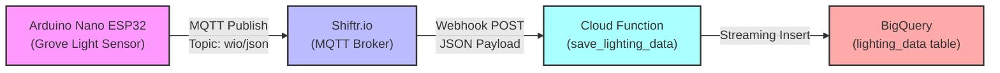

# Smart Lighting Control Data Pipeline

## Overview

Cloud Function (2nd Gen) that receives smart lighting control data from [Arduino Nano ESP32 Smart Lighting Control](../../Arduino_Nano_ESP32/Smart_Lighting_Control) via **Shiftr.io MQTT broker** webhook and streams the data to **BigQuery** for analytics and historical tracking.

**Key Features:**

- Real-time webhook data reception from Shiftr.io
- Automatic validation and transformation of light sensor data
- Streaming data insertion into BigQuery
- Device identification (device_id) for multi-device tracking
- Local test mode for development
- Scalable serverless architecture

## Architecture



## Data Flow

1. **Arduino Nano ESP32** reads Grove Light Sensor (CdS GL5528)
2. **MQTT** transmits JSON via WiFi to Shiftr.io
3. **Shiftr.io** forwards data via webhook to Cloud Function
4. **Cloud Function** validates and inserts data into BigQuery
5. **BigQuery** stores time-series data for analytics and visualization
6. **Adafruit IO** also receives real-time Lux values for dashboard display

## Prerequisites

### Google Cloud

- Google Cloud Project with BigQuery enabled
- Appropriate IAM permissions for Cloud Functions and BigQuery

### Shiftr.io

- Shiftr.io account (free tier available at https://shiftr.io)

### Hardware

For hardware setup, see [Arduino Nano ESP32 Smart Lighting Control README](../../Arduino_Nano_ESP32/Smart_Lighting_Control/README.md)

## Setup

### 1. BigQuery Setup

Create dataset and table in Google Cloud Console:

```sql
CREATE SCHEMA IF NOT EXISTS diy_electronics_iot
  OPTIONS(description="IoT data from DIY projects");

CREATE TABLE IF NOT EXISTS diy_electronics_iot.lighting_data (
  timestamp TIMESTAMP NOT NULL,
  device_id STRING,
  light_level INTEGER,
  status STRING
)
PARTITION BY DATE(timestamp);
```

### 2. Local Testing (Optional)

Test the Cloud Function before deployment:

```bash
# Install dependencies
pip install -r requirements.txt

# Run local test (set environment variable)
export LOCAL_TEST_MODE=true
functions-framework --target save_lighting_data
```

In another terminal, send test data:

```bash
curl -X POST http://localhost:8080 \
  -H "Content-Type: application/json" \
  -d '{
    "device_id": "arduino_nano_esp32",
    "timestamp": 1769926200,
    "lux": 2367,
    "light_state": "ON",
    "task_executed": false,
    "wifi_connected": true,
    "retry_count": 0
  }'
```

Expected output:

```json
{
  "status": "success",
  "message": "Data received (test mode)",
  "data": {
    "timestamp": "2026-02-01T06:10:00+00:00",
    "device_id": "arduino_nano_esp32",
    "light_level": 2367,
    "status": "ON"
  }
}
```

### 3. Deploy to Google Cloud

```bash
# Set your GCP project
gcloud config set project YOUR_GCP_PROJECT_ID

# Deploy the function
gcloud functions deploy save_lighting_data \
  --gen2 \
  --region asia-northeast1 \
  --runtime python311 \
  --source . \
  --entry-point save_lighting_data \
  --trigger-http \
  --allow-unauthenticated \
  --memory 256MB \
  --timeout 60s
```

Copy the deployed function **Trigger URL** from the output (format: `https://save-lighting-data-XXXXX.a.run.app`).

### 4. Configure Shiftr.io Webhook

1. Log in to [Shiftr.io dashboard](https://shiftr.io/user/signin)
2. Navigate to your Namespace's **Settings** → **Webhooks**
3. Create new webhook:
   - **Topic**: `wio/json`
   - **URL**: Paste your Cloud Function trigger URL
   - **Method**: POST
   - **Event**: message
4. Save and enable the webhook

### 5. Configure Arduino Device

Update the sketch with Shiftr.io credentials and upload to Arduino Nano ESP32.

For detailed instructions, see [Arduino Nano ESP32 Smart Lighting Control README](../../Arduino_Nano_ESP32/Smart_Lighting_Control/README.md#setup-instructions)

## Testing

### Test via Cloud Function Trigger URL

**Using PowerShell:**

```powershell
$uri = "https://save-lighting-data-XXXXX.a.run.app"
$body = @{
    device_id = "arduino_nano_esp32"
    timestamp = 1769926200
    lux = 2367
    light_state = "ON"
    task_executed = $false
    wifi_connected = $true
    retry_count = 0
} | ConvertTo-Json

$response = Invoke-RestMethod -Uri $uri -Method POST -ContentType "application/json" -Body $body
$response
```

Expected response: `status: success` with `message: "Data inserted successfully"`

**Using curl:**

```bash
curl -X POST https://save-lighting-data-XXXXX.a.run.app \
  -H "Content-Type: application/json" \
  -d '{
    "device_id": "arduino_nano_esp32",
    "timestamp": 1769926200,
    "lux": 2367,
    "light_state": "ON",
    "task_executed": false,
    "wifi_connected": true,
    "retry_count": 0
  }'
```

### Verify Data in BigQuery

**Using bq CLI:**

```bash
bq query --use_legacy_sql=false '
  SELECT timestamp, device_id, light_level, status
  FROM `diy_electronics_iot.lighting_data`
  ORDER BY timestamp DESC
  LIMIT 10
'
```

**Using Google Cloud Console:**

1. Go to [BigQuery Console](https://console.cloud.google.com/bigquery)
2. Query Editor tab
3. Run:

```sql
SELECT * FROM `diy-electronics-485317.diy_electronics_iot.lighting_data`
ORDER BY timestamp DESC
LIMIT 20;
```

### View Logs

```bash
gcloud functions logs read save_lighting_data \
  --gen2 \
  --region asia-northeast1 \
  --follow \
  --limit 50
```

## Data Schema

### Input JSON (from Arduino)

```json
{
  "device_id": "arduino_nano_esp32",
  "timestamp": 1769926200,
  "lux": 2367,
  "light_state": "ON",
  "task_executed": false,
  "wifi_connected": true,
  "retry_count": 0
}
```

### BigQuery Table Schema

| Column        | Type      | Description                                    |
| ------------- | --------- | ---------------------------------------------- |
| `timestamp`   | TIMESTAMP | Data recording time (ISO 8601 format, UTC)     |
| `device_id`   | STRING    | Device identifier (e.g., `arduino_nano_esp32`) |
| `light_level` | INTEGER   | Light intensity in Lux (0-4096)                |
| `status`      | STRING    | Light state (`ON` or `OFF`)                    |

## References

- [Cloud Functions Documentation](https://cloud.google.com/functions/docs)
- [BigQuery Documentation](https://cloud.google.com/bigquery/docs)
- [Shiftr.io Documentation](https://www.shiftr.io/docs/)
- [MQTT Protocol Overview](https://mqtt.org/)
- [Arduino Nano ESP32 Smart Lighting Control](../../Arduino_Nano_ESP32/Smart_Lighting_Control)

---

**Related Projects:**

- [Arduino Nano ESP32 Smart Lighting Control](../../Arduino_Nano_ESP32/Smart_Lighting_Control) - Hardware sketch and sensors
- [Wio Terminal Weather Station](../../Wio_Terminal/Weather_Station) - Similar IoT data pipeline example
