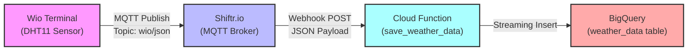

# Weather Station Data Pipeline

## Overview

Cloud Function (2nd Gen) that receives weather data from the [Wio Terminal Weather Station](../../Wio_Terminal/Weather_Station) via **Shiftr.io MQTT broker** webhook and streams the data to **BigQuery** for analytics.

**Key Features:**

- Real-time webhook data reception from Shiftr.io
- Automatic validation and transformation of sensor data
- Streaming data insertion into BigQuery
- Local test mode for development
- Scalable serverless architecture

## Architecture



## Data Flow

1. **Wio Terminal** reads DHT11 sensor (temperature, humidity)
2. **MQTT** transmits JSON via WiFi to Shiftr.io
3. **Shiftr.io** forwards data via webhook to Cloud Function
4. **Cloud Function** validates and inserts data into BigQuery
5. **BigQuery** stores time-series data for analytics and visualization

## Prerequisites

### Google Cloud

- Google Cloud Project with BigQuery enabled
- Appropriate IAM permissions for Cloud Functions and BigQuery

### Shiftr.io

- Shiftr.io account (free tier available at https://shiftr.io)

### Hardware

For hardware setup, see [Wio Terminal Weather Station README](../../Wio_Terminal/Weather_Station/README.md)

## Setup

### 1. BigQuery Setup

Create dataset and table in Google Cloud Console:

```sql
CREATE SCHEMA IF NOT EXISTS diy_electronics_iot
  OPTIONS(description="IoT data from DIY projects");

CREATE TABLE IF NOT EXISTS diy_electronics_iot.weather_data (
  timestamp TIMESTAMP NOT NULL,
  device_id STRING,
  temperature FLOAT64,
  humidity FLOAT64
)
PARTITION BY DATE(timestamp);
```

### 2. Local Testing (Optional)

Test the Cloud Function before deployment:

```bash
# Install dependencies
pip install -r requirements.txt

# Run local test
python test_local.py
```

Expected output:

```
[LOCAL TEST] Received data: {
  "timestamp": "...",
  "device_id": "wio_terminal",
  "temperature": 22.5,
  "humidity": 55.0
}

Status Code: 200
✅ TEST PASSED: Function executed successfully in test mode!
```

### 3. Deploy to Google Cloud

```bash
# Set your GCP project
gcloud config set project YOUR_GCP_PROJECT_ID

# Deploy the function
gcloud functions deploy save-weather-data \
  --gen2 \
  --region asia-northeast1 \
  --runtime python312 \
  --source . \
  --entry-point save_weather_data \
  --trigger-http \
  --allow-unauthenticated \
  --memory 256MB \
  --timeout 60s
```

Copy the deployed function **Trigger URL** from the output.

### 4. Configure Shiftr.io Webhook

1. Log in to [Shiftr.io dashboard](https://shiftr.io/user/signin)
2. Navigate to **Webhooks** section
3. Create new webhook:
   - **Topic**: `wio/json`
   - **URL**: Paste your Cloud Function trigger URL
   - **Method**: POST
   - **Format**: JSON
4. Save and enable the webhook

### 5. Configure Wio Terminal

Update the sketch with Shiftr.io credentials and upload to Wio Terminal.

For detailed instructions, see [Wio Terminal Weather Station README](../../Wio_Terminal/Weather_Station/README.md#setup-instructions)

## Testing

### Test via Cloud Function Trigger URL

```bash
curl -X POST https://YOUR_REGION-YOUR_PROJECT_ID.cloudfunctions.net/save-weather-data \
  -H "Content-Type: application/json" \
  -d '{
    "device_id": "wio_terminal",
    "temperature": 22.5,
    "humidity": 55.0
  }'
```

Expected response: `Success` (status code 200)

### Verify Data in BigQuery

```bash
bq query --use_legacy_sql=false '
  SELECT timestamp, device_id, temperature, humidity
  FROM `diy_electronics_iot.weather_data`
  ORDER BY timestamp DESC
  LIMIT 10
'
```

### View Logs

```bash
gcloud functions logs read save-weather-data \
  --region asia-northeast1 \
  --follow \
  --limit 50
```

## References

- [Cloud Functions Documentation](https://cloud.google.com/functions/docs)
- [BigQuery Documentation](https://cloud.google.com/bigquery/docs)
- [Shiftr.io Documentation](https://www.shiftr.io/docs/)
- [MQTT Protocol Overview](https://mqtt.org/)
- [Wio Terminal Weather Station](../../Wio_Terminal/Weather_Station)

---

**Related Projects:**

- [Wio Terminal Weather Station](../../Wio_Terminal/Weather_Station) - Hardware sketch and sensors
