# Wio Terminal Weather Station with Adafruit IO

## Overview

This project extends the Wio Terminal weather station by integrating it with **Adafruit IO**, a cloud-based IoT platform. It measures ambient temperature and humidity using a Grove - DHT11 sensor and publishes the data to Adafruit IO for remote monitoring and data logging via MQTT protocol.

- **Adafruit IO Dashboard**: [Weather Station](https://io.adafruit.com/asamiinae/dashboards/weather-station)

[](https://gyazo.com/2f3f2dd6637c2fdf2869a831bb386971)

### Features

- **Real-time Cloud Publishing**: Sends temperature and humidity data to Adafruit IO via MQTT
- **Remote Monitoring**: Access your weather data from anywhere via the Adafruit IO dashboard
- **WiFiManager Integration**: User-friendly setup portal for Wi-Fi credentials without hard-coding
- **Data Logging**: Automatic data archival on Adafruit IO for historical analysis

### Architecture

```mermaid
graph LR
    subgraph "Edge (Physical Layer)"
        WIO["🌡️ Wio Terminal<br/>+ DHT11 Sensor"]
    end
    
    subgraph "Cloud (IoT Platform)"
        ADAFRUIT["☁️ Adafruit IO<br/>MQTT Broker & Store"]
        TEMP["📊 Temperature Feed"]
        HUMIDITY["💧 Humidity Feed"]
        ADAFRUIT --> TEMP
        ADAFRUIT --> HUMIDITY
    end
    
    subgraph "Visualization"
        DASHBOARD["📈 Dashboard<br/>Gauges & Charts"]
        DISCORD["🔔 Discord<br/>Notifications"]
    end
    
    WIO -->|WiFi + MQTT<br/>Publish| ADAFRUIT
    TEMP --> DASHBOARD
    HUMIDITY --> DASHBOARD
    ADAFRUIT -->|Webhook<br/>Trigger| DISCORD
```



**Data Flow:**
1. **Wio Terminal** reads temperature and humidity from DHT11 sensor
2. **MQTT Protocol** transmits data via WiFi to Adafruit IO
3. **Adafruit IO** receives and stores data, updates feeds
4. **Dashboard** displays real-time data visualization
5. **Discord** sends notifications when thresholds are exceeded (optional)

## Prerequisites

### Hardware Setup
For hardware setup and assembly instructions, see [parent README](../README.md#hardware-setup).

### Software Prerequisites
- Wio Terminal with Arduino IDE setup (see [parent README](../README.md#software-setup))
- Active Adafruit IO account
- WiFiManager library installed

## Setup Instructions

### 1. Adafruit IO Setup

1. Create an account at [Adafruit IO](https://io.adafruit.com)
2. Create two feeds:
   - `temperature` - for temperature data
   - `humidity` - for humidity data
3. Create a dashboard and add gauges for each feed
4. Get your Adafruit IO credentials:
   - Go to **Settings** and note your **Username**
   - Generate an **AIO Key** from the same page

### 2. Arduino Sketch Configuration

Ensure you have installed the required libraries:
- `Adafruit_MQTT_Library`
- `WiFiManager` by tzapu
- `DHT` sensor library
- `Adafruit_Sensor`

For Arduino IDE setup and library installation details, see [parent README](../README.md#software-setup).

Update the sketch with your Adafruit IO credentials:

```cpp
#define AIO_USERNAME "your_username"
#define AIO_KEY "your_aio_key"
```

### 3. Upload & Configure

1. Upload the sketch to Wio Terminal
2. On first boot, connect to the WiFiManager AP and enter your Wi-Fi SSID and password
3. The device will connect to WiFi and start publishing data to Adafruit IO

## Optional: Setting Up Discord Notifications

Get real-time alerts when sensor values exceed thresholds.

### Steps

1. **Create a Discord Webhook**
   - In your Discord server: **Server Settings** → **Integrations** → **Webhooks**
   - Create a new webhook for your desired channel and copy the **Webhook URL**

2. **Create an Adafruit IO Reactive Action**
   - In Adafruit IO, go to **Actions** → **Create Action**
   - Configure a trigger for your temperature feed (e.g., value > 30°C)
   - Set the action to send an HTTP webhook POST
   - Use the Discord webhook URL as the target
   - Include the following JSON body:

```json
{
  "content": "🚨 High Temperature Alert!",
  "embeds": [{
    "title": "🌡️ Overtemperature Notification",
    "description": "The temperature has exceeded the 30°C threshold.",
    "color": 16734296
  }]
}
```

## Troubleshooting

| Issue | Solution |
| --- | --- |
| Cannot connect to Adafruit IO | Verify AIO_USERNAME and AIO_KEY are correct. Check WiFi connection. |
| No data appearing in dashboard | Ensure feeds exist in Adafruit IO. Check that MQTT feed names match the sketch. |
| WiFiManager portal not appearing | Press Wio Terminal's Reset button on first boot. |
| Compile errors for MQTT library | Make sure all required libraries are installed via Arduino Library Manager. |

## References

- [Adafruit IO Documentation](https://io.adafruit.com/api/docs/)
- [MQTT Protocol Overview](https://mqtt.org/)
- [Adafruit MQTT Library](https://github.com/adafruit/Adafruit_MQTT_Library)
- [WiFiManager by tzapu](https://github.com/tzapu/WiFiManager)

## Author

[Asami.K](https://asami.tokyo/)

<a href="https://www.buymeacoffee.com/asamiii" target="_blank"></a>
