# Wio Terminal Weather Station with Shiftr.io

## Overview

This project extends the Wio Terminal weather station by integrating it with **Shiftr.io**, a hosted MQTT broker service. It measures ambient temperature and humidity using a Grove - DHT11 sensor and publishes the data to Shiftr.io in JSON format for real-time data streaming and IoT applications.

### Features

- **Real-time Cloud Publishing**: Sends temperature and humidity data to Shiftr.io via MQTT
- **JSON Data Format**: Flexible JSON payload for custom data structures
- **Remote Monitoring**: Access your weather data from anywhere via Shiftr.io
- **MQTT Topics**: Organized data publishing to configurable topics
- **Scalable Architecture**: Support for multiple devices and subscribers

### Architecture

```mermaid
graph LR
    subgraph "Edge (Physical Layer)"
        WIO["🌡️ Wio Terminal<br/>+ DHT11 Sensor"]
    end

    subgraph "Cloud (IoT Platform)"
        SHIFTR["☁️ Shiftr.io<br/>MQTT Broker"]
        TOPIC["📡 wio/json<br/>Topic"]
        SHIFTR --> TOPIC
    end

    subgraph "Integration"
        DASHBOARD["📊 Custom Dashboard<br/>or Node-RED"]
        WEBHOOK["🔗 Webhooks<br/>& Scripts"]
    end

    WIO -->|WiFi + MQTT<br/>Publish JSON| SHIFTR
    TOPIC --> DASHBOARD
    SHIFTR --> WEBHOOK
```



**Data Flow:**

1. **Wio Terminal** reads temperature and humidity from DHT11 sensor
2. **MQTT Protocol** transmits JSON data via WiFi to Shiftr.io
3. **Shiftr.io** receives and broadcasts data on the `wio/json` topic
4. **Subscribers** receive real-time updates for dashboards or integrations

## Prerequisites

### Hardware Setup

For hardware setup and assembly instructions, see [parent README](../README.md#hardware-setup).

### Software Prerequisites

- Wio Terminal with Arduino IDE or Arduino CLI setup (see [parent README](../README.md#software-setup))
- Active Shiftr.io account
- Required libraries: `PubSubClient`, `ArduinoJson`

## Setup Instructions

### 1. Shiftr.io Setup

1. Create an account at [Shiftr.io](https://www.shiftr.io/)
2. Create a new MQTT instance (namespace):
   - Click "New Instance" or similar option
   - Enter a name (e.g., `wio-weather-station`)
3. Copy your instance credentials:
   - **Instance Name/Key**: Your unique identifier (case-sensitive)
   - **API Token/Secret**: Authentication credential

### 2. Arduino Sketch Configuration

Ensure you have installed the required libraries:

- `PubSubClient` by Nick O'Leary
- `ArduinoJson` by Benoit Blanchon
- `DHT` sensor library by Adafruit
- `Adafruit_Sensor` by Adafruit

For Arduino IDE setup and library installation details, see [parent README](../README.md#software-setup).

Update the sketch with your Shiftr.io credentials in `credentials.h`:

```cpp
#define SHIFTR_KEY "your_instance_name"       // Your Shiftr.io instance name (case-sensitive)
#define SHIFTR_SECRET "your_api_token"        // Your Shiftr.io API token
```

### 3. Upload & Configure

1. Update `credentials.h` with your Shiftr.io credentials
2. Compile and upload the sketch to Wio Terminal
3. The device will connect to WiFi and automatically start publishing data to Shiftr.io

## Data Format

The Wio Terminal publishes sensor data in JSON format to the `wio/json` topic:

```json
{
  "device_id": "wio_terminal",
  "temperature": 25.5,
  "humidity": 55.3
}
```

**Topic**: `wio/json`  
**Publish Interval**: Every 60 seconds

### JSON Payload Details

| Field       | Type   | Unit | Description                               |
| ----------- | ------ | ---- | ----------------------------------------- |
| device_id   | String | —    | Device identifier (fixed: "wio_terminal") |
| temperature | Float  | °C   | Current temperature reading               |
| humidity    | Float  | %    | Current relative humidity reading         |

## References

- [Shiftr.io Documentation](https://www.shiftr.io/docs/)
- [MQTT Protocol Overview](https://mqtt.org/)
- [PubSubClient Library](https://github.com/knolleary/pubsub_client)
- [ArduinoJson Library](https://github.com/bblanchon/ArduinoJson)

## Author

[Asami.K](https://asami.tokyo/)

<a href="https://www.buymeacoffee.com/asamiei" target="_blank"></a>
