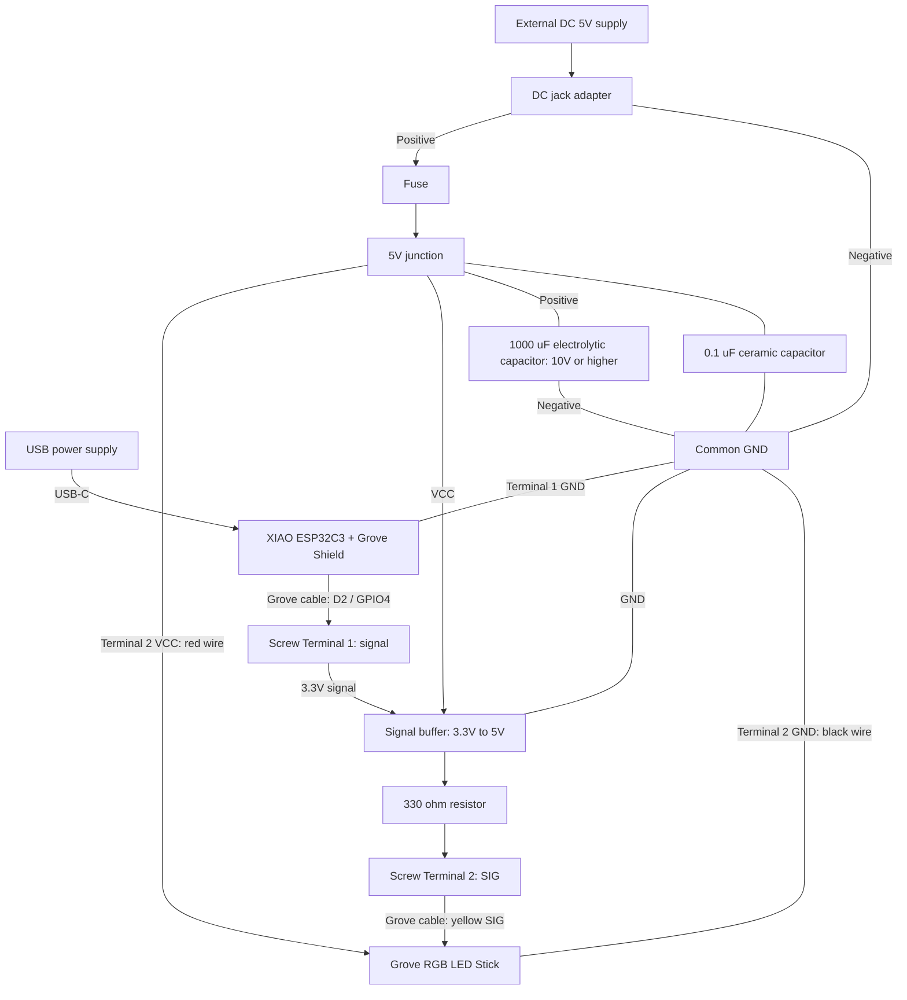

# XIAO ESP32C3 LED Color Preview

## Overview

Control the color and brightness of a Grove RGB LED Stick from the Arduino IoT Remote smartphone app to compare physical LED lighting with 3DCG lighting.

This README describes the planned build. The control sketch has not been implemented, and the wiring has not been tested with the selected components.

### Features

- RGB color and brightness control from a smartphone
- Ten LEDs displaying the same color
- Separate 5V LED power supply

## Bill of Materials

#### Control System

| Part Type | Unit | Role/Notes |
| --- | --- | --- |
| [XIAO ESP32C3 PRE-SOLDERED](https://link.amazon/B0c237jnG) | 1 | Main controller with WiFi; headers pre-soldered |
| [Seeed Studio XIAO Grove Shield](https://jp.seeedstudio.com/Grove-Shield-for-Seeeduino-XIAO-p-4621.html) | 1 | Grove connection interface |

#### Input & Output

| Part Type                                      | Unit | Role/Notes     |
| ---------------------------------------------- | ---- | -------------- |
| [Grove RGB LED Stick 104020131](https://jp.seeedstudio.com/Grove-RGB-LED-Stick-10-WS2813-Mini.html) | 1 | Ten WS2813 Mini LEDs; Grove cable included |

#### Power System

| Part Type                                                                                         | Unit | Role/Notes                               |
| ------------------------------------------------------------------------------------------------- | ---- | ---------------------------------------- |
| [Power Supply (5V, 2A+)](https://amzn.to/4jZEIyu) or [Mobile Power Bank](https://amzn.to/45jTQ5W) | 1    | Power supply for LEDs.                   |
| [Grove Screw Terminal](https://link.amazon/B022xHEM0) | 2 | Separate Shield-side and LED-side wiring without cutting cables |
| [DC jack adapter (female)](https://amzn.to/3IdZI7k)                                               | 1    | Connect the AC adapter to the breadboard |
| [Logic Level Shifter](https://amzn.to/4eeDyhr) | 1     | To convert the data signal voltage. |
| [Electrolytic Capacitor (1000µF)](https://amzn.to/45ZOWLQ)                                        | 1    | For power supply stabilization           |

#### Prototyping & Wiring

| Part Type                                      | Unit  | Role/Notes                         |
| ---------------------------------------------- | ----- | ---------------------------------- |
| [Breadboard](https://amzn.to/40bMzlk)          | 1     | Circuit base (for prototype)       |
| [Jumper Wires](https://amzn.to/45voWYC)        | 1 set | Connecting parts together          |
| [Resistor (300-500Ω)](https://amzn.to/4kMejW2) | 1     | For protecting the LED's data line |
| [USB-C Cable](https://amzn.to/4lU4bdZ)        | 1    | For programming and powering . |

The LED channels draw approximately 0.48A at full white (10 LEDs × 3 channels × 16mA). Measure total current to select wire, terminal, and fuse ratings.

#### Optional Parts

These parts are not required for LED operation but provide additional protection against excessive current in the wiring.

- **Fuse (1):** [Littelfuse 0287001.PXCN](https://www.marutsu.co.jp/pc/i/2563488/) — 1A, DC32V, ATO type. The main listing has a 10-piece minimum; an alternate one-piece purchase option is also listed.
- **Fuse holder / case (1):** [Littelfuse FHAC0002ZXJ](https://www.marutsu.co.jp/pc/i/15761797/) — wired inline holder compatible with the ATO fuse.

Verify wire ratings and startup current before finalizing the 1A fuse. If fitted, place it on the positive wire near the DC power input, before the LED/buffer power split. The wiring diagram below includes this optional fuse; if omitted, connect the DC jack positive directly to the 5V junction.

## Software Setup

### 1. Arduino IDE Configuration

Install Arduino IDE following the [official guide](https://docs.arduino.cc/software/ide/).

### 2. Board Configuration

Install the **esp32 by Espressif Systems** board package and select **XIAO_ESP32C3**. Use **D2 (GPIO4)** for the LED signal; do not use the Nano pin mapping. Attach the included WiFi antenna.

### 3. Required Libraries

- **ArduinoIoTCloud** — Arduino Cloud communication
- **Adafruit_NeoPixel** — WS2813 LED control
- **WiFi** — included with the board package

### 4. Hardware Setup

Turn off all power before inserting the XIAO into the Grove Shield with the correct orientation. Power the XIAO through USB-C and the LED circuit from the separate 5V supply.

#### Wiring List

Connect Screw Terminal 1 to the Shield Grove port carrying **D2 / A2**. Verify its primary signal terminal connects to XIAO **D2 (GPIO4)** before wiring. Connect Screw Terminal 2 to the LED using the other Grove cable.

| From | To |
| --- | --- |
| USB power supply | XIAO USB-C |
| Terminal 1 primary signal: D2 / GPIO4 | Buffer input |
| Buffer output | 330Ω resistor → Terminal 2 SIG → LED SIG (yellow) |
| External 5V supply positive | DC jack adapter → fuse → 5V junction |
| 5V junction | Terminal 2 VCC → LED VCC (red), and buffer VCC |
| Supply negative (common GND) | Terminal 1 GND → XIAO GND, buffer GND, and Terminal 2 GND → LED GND (black) |
| Electrolytic capacitor positive / negative | 5V / common GND at the LED power input |
| 0.1µF capacitor terminals | Buffer VCC / GND, close to the buffer; omit if already included |

**Leave disconnected:** Terminal 1 VCC and unused signal, Terminal 2 NC (LED white wire), and XIAO 5V/3V3 power pins. Do not join the two terminals' VCC connections.

Configure the buffer enable pins according to the selected component's specifications. The diagram shows connections, not physical terminal positions. Screw Terminals do not convert signal levels. Select wires suitable for both the terminals and load current; do not force 18AWG wire into the Grove Screw Terminal.

Check pin assignments, polarity, fastening, and insulation before powering on. Do not apply 5V to XIAO GPIO pins or 9V/12V to the LED.

### 5. Credentials Configuration

Register the XIAO ESP32C3 as a third-party ESP32 device in Arduino Cloud and configure the 2.4GHz WiFi credentials. Keep credentials out of version control.

### 6. LED Control and Configuration

Implement a dedicated sketch to display the same RGB color on all ten LEDs. Verify the color order using separate red, green, and blue tests. Store RGB and brightness separately, and keep the LEDs off at startup.

The sketch must apply Arduino Cloud variable changes to the LED output. No uploadable sketch is currently included.

### 7. Test

1. Display red, green, blue, and white at low brightness; check all ten LEDs.
2. Change color and brightness in the app; verify that brightness 0 turns the LEDs off.
3. Check current, voltage, and temperature at the maximum intended brightness.
4. Verify control after a power cycle and WiFi reconnection.

## Cloud Integration

Use **Arduino IoT Remote (iOS/Android)**.

1. Add a third-party ESP32 device in Arduino Cloud using the matching XIAO ESP32C3 board option. Save its Device ID and Secret Key, and configure 2.4GHz WiFi. Confirm successful registration and connection before testing app control.
2. Create four Read & Write integer variables: `red`, `green`, `blue`, and `brightness`.
3. Add four dashboard sliders with a range of 0–255 and link them to the variables.
4. Open the dashboard in Arduino IoT Remote.

An Arduino Cloud account, internet access, and a plan supporting four variables are required.

## References

- [XIAO ESP32C3 Documentation and Pinout](https://wiki.seeedstudio.com/XIAO_ESP32C3_Getting_Started/)
- [Grove Shield for XIAO](https://wiki.seeedstudio.com/Grove-Shield-for-Seeeduino-XIAO-embedded-battery-management-chip/)
- [Grove RGB LED Stick Specifications and Pinout](https://wiki.seeedstudio.com/Grove-RGB_LED_Stick-10-WS2813_Mini/)
- [Arduino Cloud / IoT Remote](https://cloud.arduino.cc/how-it-works/)
- [Grove-to-Jumper Conversion Cable](https://jp.seeedstudio.com/Grove-4-pin-Female-Jumper-to-Grove-4-pin-Conversion-Cable-5-PCs-per-PAck.html)
- [Grove Screw Terminal](https://wiki.seeedstudio.com/Grove-Screw_Terminal/)
