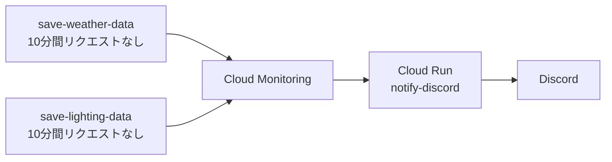

# Monitoring から Discord への通知

[English](README.md) | [日本語](README.ja.md)

## 概要

[Weather Station v2 + Smart Lighting Control のスケッチ](../../../mcu/samd51/Wio_Terminal/External_Sensor/Weather_Station_v2_Smart_Lighting_Control/sketch/Weather_Station_v2_Smart_Lighting_Control/Weather_Station_v2_Smart_Lighting_Control.ino)用の停止通知です。気象・照明を個別に監視し、どちらかのリクエストが10分間途絶えると、Cloud Runの `notify-discord` を経由してDiscordへ通知します。



監視対象はリクエストの到着で、失敗したリクエストも含みます。BigQueryへの保存成功を判定する機能ではありません。検知・通知までの時間は設定した10分より長くなる場合があります。

## 部品表

| サービス | 用途 |
| --- | --- |
| Google Cloud | Cloud Run、Cloud Monitoring、ソースのビルド |
| Discordのサーバー・チャンネル | 通知先 |

## 開発

### ハードウェア開発

[統合プロジェクトのハードウェア設定](../../../mcu/samd51/Wio_Terminal/External_Sensor/Weather_Station_v2_Smart_Lighting_Control/README.ja.md#ハードウェア開発)を使用します。追加のハードウェアは不要です。

### ソフトウェア開発

1. [共通クラウドガイドの準備](../../../docs/cloud-functions.ja.md#準備)に従い、Google Cloud CLIを用意してログインし、プロジェクトを選択します。
   - 既存環境はプロジェクト `diy-electronics-485317`、リージョン `asia-northeast1` です。気象・照明の受信環境は先に[統合プロジェクトのクラウド連携](../../../mcu/samd51/Wio_Terminal/External_Sensor/Weather_Station_v2_Smart_Lighting_Control/README.ja.md#クラウド連携)で設定します。

2. Discordの通知先チャンネルで **チャンネルの編集 → 連携サービス → ウェブフック** を開き、Webhookを作成してURLを控えます。

3. ターミナルで `cloud/Cloud_Functions/Monitoring_Alert_to_Discord` に移動し、Cloud Runへデプロイします。

   ```sh
   gcloud run deploy notify-discord --source . --function notify_discord --base-image python312 --region asia-northeast1 --allow-unauthenticated
   ```
   - サービス名は `notify-discord`、Pythonのエントリーポイントは [main.py](main.py) の `notify_discord` です。依存ライブラリは [requirements.txt](requirements.txt) を使用します。CLIの案内に従い、必要なAPIとビルド権限を設定します。サービスが作成済みでコードの更新が不要な場合は、この手順を省略します。

4. **Cloud Run → notify-discord → 新しいリビジョンの編集とデプロイ → 変数とシークレット** を開き、`DISCORD_WEBHOOK_URL` にDiscordのWebhook URLを設定してデプロイします。
   - URLは公開しません。Secret Managerを使う場合も、同じ環境変数名にシークレットを割り当てます。Cloud Runの概要画面でサービスURLを控えます。

#### クラウド連携

1. **Monitoring → アラート → 通知チャネルを編集 → Webhook** を開き、**Discord** という通知チャネルを作成します。
   - URLには `notify-discord` のサービスURLを設定します。`@everyone` を付けたい場合だけ末尾に `?channel=critical` を追加します。通知レベルによらず同じDiscord通知先を使います。設定済みの場合は既存の通知チャネルを使用します。

2. 以下の設定で、2つのアラートポリシーを作成または編集します。

   | 設定項目 | 気象 | 照明 |
   | --- | --- | --- |
   | ポリシー名 | `weather-station - Data delivery outage` | `lighting - Data delivery outage` |
   | リソース | Cloud Run Revision | Cloud Run Revision |
   | 指標 | `run.googleapis.com/request_count` | `run.googleapis.com/request_count` |
   | フィルタ：`service_name` | `save-weather-data` | `save-lighting-data` |
   | 条件の種類 | 指標の不在（Metric absence） | 指標の不在（Metric absence） |
   | 再テスト期間／不在の判定時間 | 10分（`600s`） | 10分（`600s`） |
   | 通知チャネル | Discord | Discord |

   - 指標が表示されない場合は、アクティブな時系列だけを表示するフィルタを解除します。対象プロジェクトとリージョンに絞り、特定のリビジョンではなくサービス全体を監視します。ローリングウィンドウは5分とし、リビジョン間のリクエスト数を合計してから不在を判定します。トリガーは「いずれかの時系列」にします。
   - どちらか一方の停止で通知するため、ポリシーは個別に作成します。旧 `Arduino Nano ESP32 outage alert` がある場合は、照明用ポリシーを重複作成せず名前を変更します。

3. 各ポリシーの説明に監視対象と確認箇所を記載し、両方を有効にして保存します。
   - 記載例：`save-lighting-dataへのリクエストが10分間ありません。Wioの電源・Wi-Fi、Shiftr、Webhook、Cloud Runログを確認してください。`
   - 指標の不在を検知するには、時系列が一度観測されている必要があります。停止テストの前に通常送信を開始します。復旧時も通知したい場合は、インシデント終了時の通知を有効にします。

#### 通知文

停止時は次の英語の形式で通知します。時刻はMonitoringのインシデント時刻を日本時間で表示します。

```text
⚠️ Data delivery stopped: lighting

No requests for lighting data have been received for 10 minutes.

Target: Wio Terminal / save-lighting-data
Detected at: 2026/10/07 16:00:00 JST

Check:
- Wio Terminal power and Wi-Fi
- Shiftr connection and webhook
- Cloud Run logs

Details: <incident URL>
```

気象側は `weather-station` / `save-weather-data` と表示します。復旧通知を有効にすると「✅ Data delivery alert cleared」とインシデントの終了を表示します。BigQueryへの保存再開は別途確認してください。対象外のポリシーはMonitoringの概要文を表示します。

文面を稼働サービスへ反映するには、ソフトウェア開発の手順3で再デプロイします。

### テスト

1. Monitoringの通知チャネル設定でテスト通知を送り、Discordに届くことを確認します。
   - 実際のメッセージが送信されます。`channel=critical` では `@everyone` が付く場合があります。

2. 気象・照明の通常受信を確認してから、Shiftrの照明用BigQuery転送Webhookだけを一時的に無効にし、10分以上待って照明の停止通知を確認します。確認後はすぐに有効へ戻します。
   - 気象の送信を継続し、気象側では通知されないことを確認します。必要に応じて気象側でも繰り返します。Webhookを無効にしている間はデータが転送されないため、実施時間を調整してください。

3. 届かない場合は **Cloud Run → notify-discord → ログ** を確認します。
   - `Successfully sent notification to Discord` が通知中継の成功ログです。HTTP 400の場合は `DISCORD_WEBHOOK_URL` の未設定を確認し、値は表示しません。Discord APIのエラーの場合はWebhookが有効か確認します。

## 参考資料

### 共通ガイド

- [Wio Terminal統合プロジェクト](../../../mcu/samd51/Wio_Terminal/External_Sensor/Weather_Station_v2_Smart_Lighting_Control/README.ja.md)
- [クラウド環境の準備](../../../docs/cloud-functions.ja.md)
- [認証情報の扱い](../../../docs/credentials.ja.md)
- [Cloud Run関数のデプロイ](https://docs.cloud.google.com/run/docs/deploy-functions)
- [指標の不在アラート](https://docs.cloud.google.com/monitoring/alerts/metric-absence)
- [MonitoringのWebhook通知](https://cloud.google.com/monitoring/support/notification-options#webhooks)

## 作者

[Asami.K](https://asami.tokyo/)

<a href="https://www.buymeacoffee.com/asamiei" target="_blank"></a>
