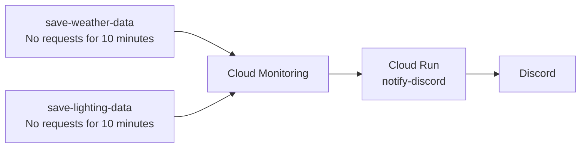

# Monitoring Alert to Discord

[English](README.md) | [Japanese](README.ja.md)

## Overview

Discord outage alerts for the [Weather Station v2 + Smart Lighting Control sketch](../../../mcu/samd51/Wio_Terminal/External_Sensor/Weather_Station_v2_Smart_Lighting_Control/sketch/Weather_Station_v2_Smart_Lighting_Control/Weather_Station_v2_Smart_Lighting_Control.ino). Two independent Cloud Monitoring policies monitor weather and lighting delivery. Either route having no requests for 10 minutes triggers a notification through the Cloud Run service `notify-discord`.



This monitors request arrival, including failed requests; it does not verify successful BigQuery insertion. Detection and notification can take longer than the configured 10 minutes.

## Bill of Materials

| Service | Purpose |
| --- | --- |
| Google Cloud | Cloud Run, Cloud Monitoring, and source-build services |
| Discord server and channel | Notification destination |

## Development

### Hardware Development

Use the [integrated project's hardware setup](../../../mcu/samd51/Wio_Terminal/External_Sensor/Weather_Station_v2_Smart_Lighting_Control/README.md#hardware-development). No additional hardware is required.

### Software Development

1. Prepare Google Cloud CLI, sign in, and select the project using the [shared cloud guide](../../../docs/cloud-functions.md#preparation).
   - The existing installation uses project `diy-electronics-485317` and region `asia-northeast1`. The weather and lighting pipelines must already receive data; see the [integrated cloud setup](../../../mcu/samd51/Wio_Terminal/External_Sensor/Weather_Station_v2_Smart_Lighting_Control/README.md#cloud-integration).

2. In Discord, open the destination channel's **Edit Channel → Integrations → Webhooks**, create a webhook, and copy its URL privately.

3. Open this repository's `cloud/Cloud_Functions/Monitoring_Alert_to_Discord` directory in a terminal and deploy the function to Cloud Run.

   ```sh
   gcloud run deploy notify-discord --source . --function notify_discord --base-image python312 --region asia-northeast1 --allow-unauthenticated
   ```
   - Service name: `notify-discord`; Python entry point: `notify_discord` in [main.py](main.py). Dependencies are in [requirements.txt](requirements.txt). Follow the CLI prompts to enable required APIs and configure build permissions. If the service already exists and its code needs no update, skip deployment.

4. Open **Cloud Run → notify-discord → Edit & deploy new revision → Variables & Secrets**. Set `DISCORD_WEBHOOK_URL` to the Discord webhook URL and deploy the revision.
   - Keep the URL private. For secret storage, bind a Secret Manager secret to the same environment-variable name. Copy the service URL from the Cloud Run overview.

#### Cloud integration

1. Open **Monitoring → Alerting → Edit notification channels → Webhooks** and create a channel named **Discord**.
   - URL: the `notify-discord` service URL. Append `?channel=critical` only if you want `@everyone` mentions. All notification levels use the same Discord destination. Reuse the existing Discord notification channel if configured.

2. Create or edit two alert policies using the following settings.

   | Setting | Weather | Lighting |
   | --- | --- | --- |
   | Policy name | `weather-station - Data delivery outage` | `lighting - Data delivery outage` |
   | Resource | Cloud Run Revision | Cloud Run Revision |
   | Metric | `run.googleapis.com/request_count` | `run.googleapis.com/request_count` |
   | Filter: `service_name` | `save-weather-data` | `save-lighting-data` |
   | Condition type | Metric absence | Metric absence |
   | Retest window / absence duration | 10 minutes (`600s`) | 10 minutes (`600s`) |
   | Notification channel | Discord | Discord |

   - Disable the active-time-series filter if the metric is not listed. Scope the resource to the intended project and region. Monitor the whole service across revisions; do not select a single revision. Use a 5-minute rolling window and sum request counts across revisions before evaluating absence. Set the trigger to any time series.
   - Keep the policies separate so either route can notify independently. Rename the old `Arduino Nano ESP32 outage alert` if it exists instead of creating a duplicate lighting policy.

3. Add a policy description identifying the route and troubleshooting steps, enable both policies, and save.
   - Example: `No requests to save-lighting-data for 10 minutes. Check Wio Terminal power/Wi-Fi, Shiftr, its webhook, and Cloud Run logs.`
   - Metric-absence monitoring needs a previously observed time series. Start normal device transmission before testing an outage. Enable incident-closure notifications if you also want recovery messages.

#### Notification text

Outage notifications use English text, with incident timestamps converted to JST:

```text
⚠️ Data delivery stopped: lighting

No requests for lighting data have been received for 10 minutes.

Target: Wio Terminal / save-lighting-data
Detected at: 2026/10/07 16:00:00 JST

Check:
- Wio Terminal power and Wi-Fi
- Shiftr connection and webhook
- Cloud Run logs

Details: <incident URL>
```

Weather notifications identify `weather-station` / `save-weather-data`. If closure notifications are enabled, the title becomes “✅ Data delivery alert cleared” and notes that the monitoring incident has closed. Verify BigQuery recovery separately. Other policies retain the Monitoring summary.

Redeploy using Software Development step 3 to apply the new wording to the running service.

### Test

1. In the Monitoring notification channel settings, send a test notification and confirm it arrives in Discord.
   - This sends a real message. For `channel=critical`, it can mention `@everyone`.

2. Confirm weather and lighting are arriving normally. Temporarily disable only the lighting Shiftr-to-BigQuery webhook and wait more than 10 minutes for a lighting alert. Re-enable it immediately after the test.
   - Keep the weather route running and verify that it does not alert. Repeat for weather if needed. Coordinate this test because data is not forwarded while a webhook is disabled.

3. If delivery fails, open **Cloud Run → notify-discord → Logs**.
   - `Successfully sent notification to Discord` confirms relay success. HTTP 400 can indicate a missing `DISCORD_WEBHOOK_URL`; check its presence without displaying it. A Discord API error can indicate an invalid webhook.

## References

### Common guides

- [Integrated Wio Terminal project](../../../mcu/samd51/Wio_Terminal/External_Sensor/Weather_Station_v2_Smart_Lighting_Control/README.md)
- [Cloud preparation](../../../docs/cloud-functions.md)
- [Credential handling](../../../docs/credentials.md)
- [Deploy a Cloud Run function](https://docs.cloud.google.com/run/docs/deploy-functions)
- [Metric-absence alerts](https://docs.cloud.google.com/monitoring/alerts/metric-absence)
- [Monitoring webhook notifications](https://cloud.google.com/monitoring/support/notification-options#webhooks)

## Author

[Asami.K](https://asami.tokyo/)

<a href="https://www.buymeacoffee.com/asamiei" target="_blank"></a>
