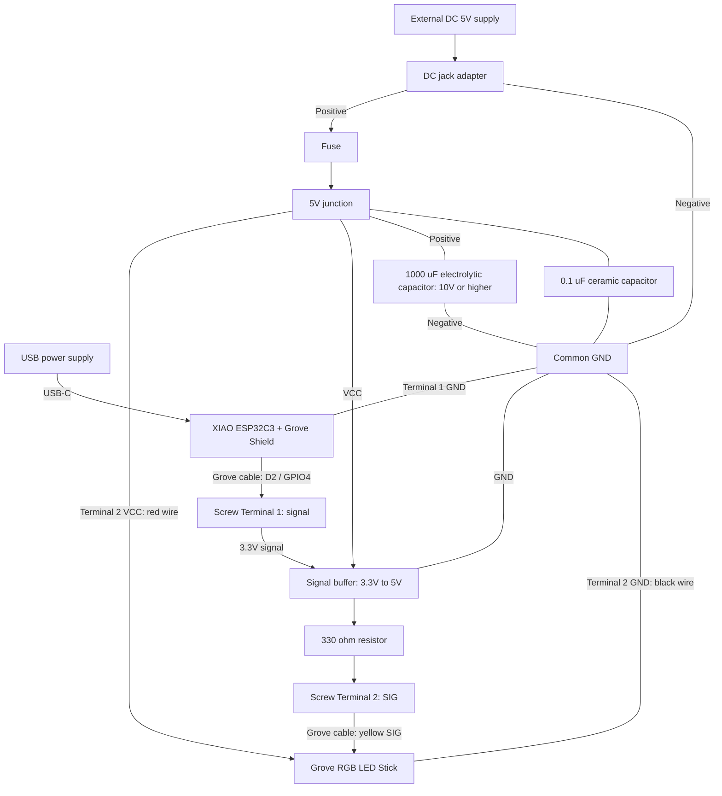

# XIAO ESP32C3 LED 発光色プレビュー

[English](README.md) | [日本語](README.ja.md)

## 概要

Grove RGB LED Stick と Arduino IoT Remote を使用し、実物の発光色・明るさを 3DCG の照明と比較する計画です。10 個の WS2813 Mini を同じ色で表示します。制御スケッチは未収録で、想定する配線も実機では未検証です。

## 部品表

### 制御系

| 部品 | 数量 | 用途・備考 |
| --- | --- | --- |
| [XIAO ESP32C3 PRE-SOLDERED](https://link.amazon/B0c237jnG) | 1 | Wi-Fi 対応マイコン。ピンヘッダ実装済み。 |
| [Seeed Studio XIAO Grove Shield](https://jp.seeedstudio.com/Grove-Shield-for-Seeeduino-XIAO-p-4621.html) | 1 | Grove 接続用インターフェース。 |

### 入出力

| 部品 | 数量 | 用途・備考 |
| ---------------------------------------------- | ---- | -------------- |
| [Grove RGB LED Stick 104020131](https://jp.seeedstudio.com/Grove-RGB-LED-Stick-10-WS2813-Mini.html) | 1 | WS2813 Mini 10 個。Grove ケーブル付属。 |

### 電源

| 部品 | 数量 | 用途・備考 |
| ------------------------------------------------------------------------------------------------- | ---- | ---------------------------------------- |
| [電源 (5V, 2A+)](https://amzn.to/4jZEIyu) または [モバイルバッテリー](https://amzn.to/45jTQ5W) | 1 | LED 用電源。 |
| [Grove Screw Terminal](https://link.amazon/B022xHEM0) | 2 | ケーブルを切らずに Shield 側と LED 側の配線を分離。 |
| [DC ジャックアダプタ（メス）](https://amzn.to/3IdZI7k) | 1 | AC アダプタをブレッドボードに接続。 |
| [ロジックレベル変換器](https://amzn.to/4eeDyhr) | 1 | 信号電圧のレベル変換。 |
| [電解コンデンサ (1000µF)](https://amzn.to/45ZOWLQ) | 1 | 電源の安定化。 |

### 試作・配線

| 部品 | 数量 | 用途・備考 |
| ---------------------------------------------- | ----- | ---------------------------------- |
| [ブレッドボード](https://amzn.to/40bMzlk) | 1 | 試作用の回路基板。 |
| [ジャンパワイヤ](https://amzn.to/45voWYC) | 1 組 | 部品間の接続用。 |
| [抵抗 (300-500Ω)](https://amzn.to/4kMejW2) | 1 | LED のデータ線保護。 |
| [USB-C ケーブル](https://amzn.to/4lU4bdZ) | 1 | 書き込み・給電用。 |

## 開発

### ハードウェア開発

#### 配線計画

XIAO は USB-C、LED 回路は別の 5V 電源で給電します。全電源を切ってから向きを確認して Grove Shield に装着します。Screw Terminal 1 を Shield の D2/A2 ポートへ接続し、主信号が GPIO4 に接続されることを確認します。Screw Terminal 2 は 2 本目の Grove ケーブルで LED に接続します。

- Terminal 1 信号 → 3.3V→5V バッファ入力、バッファ出力 → 330Ω 抵抗 → Terminal 2 SIG → LED の黄 SIG。
- 外部 5V の正極 → DC ジャック → 任意のヒューズ → 5V 分岐 → バッファ VCC、Terminal 2 VCC・LED の赤線。
- 電源の負極 → 共通 GND → Terminal 1・XIAO GND、バッファ GND、Terminal 2・LED の黒線。
- LED 電源入力に耐圧 10V 以上の 1000µF コンデンサを接続し、正極を 5V、負極を GND にします。バッファの VCC・GND 近くに 0.1µF を配置します。内蔵済みの場合は追加不要です。
- Terminal 1 の VCC・未使用信号、Terminal 2 の NC（LED 白線）、XIAO の 5V・3V3 電源ピンは未接続にします。両端子の VCC を接続しないでください。

ねじ端子はレベル変換を行いません。バッファの有効化ピンは採用部品の仕様に合わせます。図は接続関係を示すもので、物理的な端子の並びではありません。極性、固定、絶縁を確認し、XIAO GPIO に 5V、LED に 9V・12V を加えないでください。Grove 端子に 18AWG を無理に挿入せず、対応する線径を使います。

#### 接続図

#### 電流と任意の保護部品

元の説明では白色最大時の LED チャネル電流を約 0.48A（10 × 3 × 16mA）と見積もっています。配線・端子・ヒューズの定格は総電流と起動時電流を測定して決めます。任意の保護部品は [Littelfuse 0287001.PXCN](https://www.marutsu.co.jp/pc/i/2563488/)（1A・DC32V・ATO）と [FHAC0002ZXJ ホルダ](https://www.marutsu.co.jp/pc/i/15761797/)です。購入数量と適合性を確認してください。ヒューズは DC 入力付近、LED・バッファの分岐前に配置します。省略時は入力を 5V 分岐へ直接接続します。

### ソフトウェア開発

#### ボードとライブラリ

`esp32 by Espressif Systems` パッケージで `XIAO_ESP32C3` を選択し、Wi-Fi アンテナを取り付けます。信号は D2（GPIO4）で、Nano のピン配置は使用しません。`ArduinoIoTCloud`、`Adafruit_NeoPixel`、コア付属の `WiFi` を使用します。

#### Arduino Cloud の計画

XIAO ESP32C3 を外部 ESP32 デバイスとして登録し、Device ID・Secret Key を保存して 2.4GHz Wi-Fi を設定します。登録と接続を確認した後、`red`、`green`、`blue`、`brightness` の Read & Write 整数変数と、0〜255 のスライダ 4 個を作成します。iOS・Android の Arduino IoT Remote でダッシュボードを開きます。インターネット接続と 4 変数に対応するアカウントプランが必要です。

RGB と明るさを別々に管理し、起動時は消灯、クラウド変数の変更を 10 個すべてに反映する専用スケッチを実装します。赤・緑・青を個別に表示して色の順番を確認します。

### テスト

#### テスト計画

低輝度で赤・緑・青・白を表示し、アプリ操作と明るさ 0 の消灯を確認します。想定する最大輝度で電流・電圧・温度を測定し、電源再投入と Wi-Fi 再接続後の動作を確認します。

## 参考資料

### 共通ガイド

- [Arduino 開発手順](../../../../docs/arduino-development.ja.md)
- [認証情報の設定](../../../../docs/credentials.ja.md)

- [XIAO ESP32C3 ドキュメントとピン配置](https://wiki.seeedstudio.com/XIAO_ESP32C3_Getting_Started/)
- [Grove Shield for XIAO](https://wiki.seeedstudio.com/Grove-Shield-for-Seeeduino-XIAO-embedded-battery-management-chip/)
- [Grove RGB LED Stick 仕様とピン配置](https://wiki.seeedstudio.com/Grove-RGB_LED_Stick-10-WS2813_Mini/)
- [Arduino Cloud / IoT Remote](https://cloud.arduino.cc/how-it-works/)
- [Grove・ジャンパ変換ケーブル](https://jp.seeedstudio.com/Grove-4-pin-Female-Jumper-to-Grove-4-pin-Conversion-Cable-5-PCs-per-PAck.html)
- [Grove Screw Terminal](https://wiki.seeedstudio.com/Grove-Screw_Terminal/)

## 作者

[Asami.K](https://asami.tokyo/)

