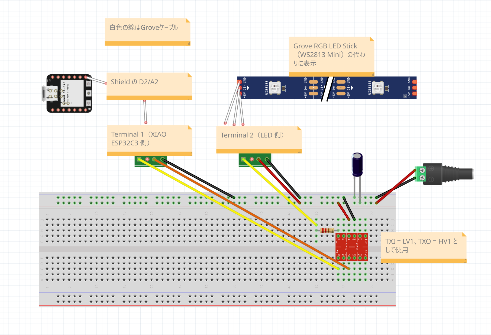

# XIAO ESP32C3 LED 発光色プレビュー

[English](README.md) | [日本語](README.ja.md)

## 概要

Grove RGB LED Stick と Arduino IoT Remote を使用し、実物の発光色・明るさを 3DCG の照明と比較する計画です。10 個の WS2813 Mini を同じ色で表示します。制御スケッチは未収録で、想定する配線も実機では未検証です。

## 部品表

### 制御系

| 部品                                                                                                     | 数量 | 用途・備考                               |
| -------------------------------------------------------------------------------------------------------- | ---- | ---------------------------------------- |
| [XIAO ESP32C3 PRE-SOLDERED](https://link.amazon/B0c237jnG)                                               | 1    | Wi-Fi 対応マイコン。ピンヘッダ実装済み。 |
| [Seeed Studio XIAO Grove Shield](https://jp.seeedstudio.com/Grove-Shield-for-Seeeduino-XIAO-p-4621.html) | 1    | Grove 接続用インターフェース。           |

### 入出力

| 部品                                                                                                | 数量 | 用途・備考                              |
| --------------------------------------------------------------------------------------------------- | ---- | --------------------------------------- |
| [Grove RGB LED Stick 104020131](https://jp.seeedstudio.com/Grove-RGB-LED-Stick-10-WS2813-Mini.html) | 1    | WS2813 Mini 10 個。Grove ケーブル付属。 |

### 電源

| 部品                                                                                           | 数量 | 用途・備考                                          |
| ---------------------------------------------------------------------------------------------- | ---- | --------------------------------------------------- |
| [電源 (5V, 2A+)](https://amzn.to/4jZEIyu) または [モバイルバッテリー](https://amzn.to/45jTQ5W) | 1    | LED 用電源。                                        |
| [Grove Screw Terminal](https://link.amazon/B022xHEM0)                                          | 2    | ケーブルを切らずに Shield 側と LED 側の配線を分離。 |
| [DC ジャックアダプタ（メス）](https://amzn.to/3IdZI7k)                                         | 1    | AC アダプタをブレッドボードに接続。                 |
| [ロジックレベル変換器](https://amzn.to/4eeDyhr)                                                | 1    | 信号電圧のレベル変換。                              |
| [電解コンデンサ (1000µF)](https://amzn.to/45ZOWLQ)                                             | 1    | 電源の安定化。                                      |

### 試作・配線

| 部品                                       | 数量 | 用途・備考           |
| ------------------------------------------ | ---- | -------------------- |
| [ブレッドボード](https://amzn.to/40bMzlk)  | 1    | 試作用の回路基板。   |
| [ジャンパワイヤ](https://amzn.to/45voWYC)  | 1 組 | 部品間の接続用。22AWG の単線がおすすめです。Grove Screw Terminal に挿せるのは 20〜30AWG です。 |
| [抵抗 (300-500Ω)](https://amzn.to/4kMejW2) | 1    | LED のデータ線保護。 |
| [USB-C ケーブル](https://amzn.to/4lU4bdZ)  | 1    | 書き込み・給電用。   |

## 開発

### ハードウェア開発

#### 配線図

Fritzing のデータ: [LED_Color_Preview.fzz](diagrams/LED_Color_Preview.fzz)

#### 接続手順

> [!IMPORTANT]
> 作業中は USB-C ケーブルと外部 5V 電源を抜いておきます。

線の色は配線図に合わせています（黄: 信号、オレンジ: 3.3V、赤: 5V、黒: GND、白: Grove ケーブル）。

1. **XIAO ESP32C3 を Grove Shield に装着する**
   - Shield の印刷に合わせて向きを確認します。
2. **XIAO ESP32C3 と LED をつなぐ**
   - Grove ケーブルで、Shield の D2/A2 ポート（[ピン配置図](https://jp.seeedstudio.com/Grove-Shield-for-Seeeduino-XIAO-p-4621.html)）と Grove Screw Terminal 1、LED Stick と Grove Screw Terminal 2 をつなぎます（[Grove Screw Terminal の回路図](https://files.seeedstudio.com/wiki/Grove-Screw_Terminal/res/Grove-Screw_Terminal_v1.0.zip)）。
   - オレンジの線をつなぐ前に、XIAO ESP32C3 と Shield だけを USB-C につなぎ、テスターで Grove Screw Terminal 1 の VCC と GND の間が約 3.3V であることを測ります。5V の場合はつながないでください（XIAO ESP32C3 が壊れる原因になります）。測り終えたら USB-C を抜きます。
   - 黄・オレンジの線と 330Ω 抵抗を配線図のとおりにつなぎます。レベル変換器はチャンネル 1（LV1・HV1）だけを使います。
3. **電源をつなぐ**
   - 赤・黒の線と 1000µF コンデンサを配線図のとおりにつなぎます。
   - コンデンサは帯のある側の足を − レールに挿します。
4. **通電前に確認する**
   - + レールと − レールがショートしていない（テスターで確認）。
   - 外部電源が 5V である（9V・12V は使わない）。
   - ねじ端子が締まり、むき出しの線同士が触れていない。Grove 端子に太い線（18AWG など）を無理に挿していない。
5. **電源を入れる**
   - 外部 5V → USB-C の順に挿します。外すときは逆の順にします。

#### 電流と任意の保護部品

ショート対策としてヒューズを付ける場合は DC ジャックの + と + レールの間に次の部品を入れます。

- [Littelfuse 0287001.PXCN](https://www.marutsu.co.jp/pc/i/2563488/)（1A・DC32V・ATO）
- [FHAC0002ZXJ ホルダ](https://www.marutsu.co.jp/pc/i/15761797/)

### ソフトウェア開発

#### 開発手順

> [!NOTE]
> インターネット接続と、変数を 4 個作成できる Arduino Cloud のプランが必要です。

1. **ボードとライブラリを準備する**
   - Arduino IDE のボードマネージャで `esp32 by Espressif Systems` を入れ、ボードに `XIAO_ESP32C3` を選びます。
   - ライブラリマネージャで `ArduinoIoTCloud` と `Adafruit_NeoPixel` を入れます。`WiFi` はボードパッケージに含まれています。
   - XIAO ESP32C3 に Wi-Fi アンテナを取り付けます。
2. **Arduino Cloud にデバイスを登録する**
   - Devices で XIAO ESP32C3 を外部の ESP32 デバイスとして登録します。
   - 表示された Device ID と Secret Key を保存します。Git には含めません。
3. **Thing を作成する**
   - Thing を作成して手順 2 のデバイスを紐付け、2.4GHz Wi-Fi の SSID とパスワードを設定します。
   - 次の変数を Integer Number・Read & Write で追加します: `red`、`green`、`blue`、`brightness`
4. **スケッチを書き込む**
   - スケッチは未作成です。次の動作で作成します。
     - LED は D2（GPIO4）につながった 10 個。Nano のピン配置は使いません。
     - 起動時は消灯します。
     - RGB と明るさを別々に持ち、変数が変わったら 10 個すべてに反映します。
   - Thing のスケッチに組み込み、XIAO ESP32C3 に書き込みます。書き込み方法は [Arduino 開発手順](../../../../docs/arduino-development.ja.md) を参照してください。
   - Arduino Cloud でデバイスがオンラインになることを確認します。
5. **ダッシュボードを作る**
   - Slider を 4 個追加し、範囲を 0〜255 にして、それぞれ `red`、`green`、`blue`、`brightness` に紐付けます。
   - スマートフォンの Arduino IoT Remote（iOS・Android）でダッシュボードを開きます。
6. **色の順番を確認する**
   - 低い明るさで赤・緑・青を 1 色ずつ表示し、指定した色で光ることを確認します。違う色で光る場合は、スケッチの色の並び（RGB・GRB など）を直します。

### テスト

#### テスト計画

低輝度で赤・緑・青・白を表示し、アプリ操作と明るさ 0 の消灯を確認します。想定する最大輝度で電流・電圧・温度を測定し、電源再投入と Wi-Fi 再接続後の動作を確認します。

## 参考資料

### 共通ガイド

- [Arduino 開発手順](../../../../docs/arduino-development.ja.md)
- [認証情報の設定](../../../../docs/credentials.ja.md)

- [XIAO ESP32C3 ドキュメントとピン配置](https://wiki.seeedstudio.com/XIAO_ESP32C3_Getting_Started/)
- [Grove Shield for XIAO](https://wiki.seeedstudio.com/Grove-Shield-for-Seeeduino-XIAO-embedded-battery-management-chip/)
- [Grove RGB LED Stick 仕様とピン配置](https://wiki.seeedstudio.com/Grove-RGB_LED_Stick-10-WS2813_Mini/)
- [Arduino Cloud / IoT Remote](https://cloud.arduino.cc/how-it-works/)
- [Grove・ジャンパ変換ケーブル](https://jp.seeedstudio.com/Grove-4-pin-Female-Jumper-to-Grove-4-pin-Conversion-Cable-5-PCs-per-PAck.html)
- [Grove Screw Terminal](https://wiki.seeedstudio.com/Grove-Screw_Terminal/)
- [Grove Screw Terminal 回路図（Eagle・PDF）](https://files.seeedstudio.com/wiki/Grove-Screw_Terminal/res/Grove-Screw_Terminal_v1.0.zip)

## 作者

[Asami.K](https://asami.tokyo/)

