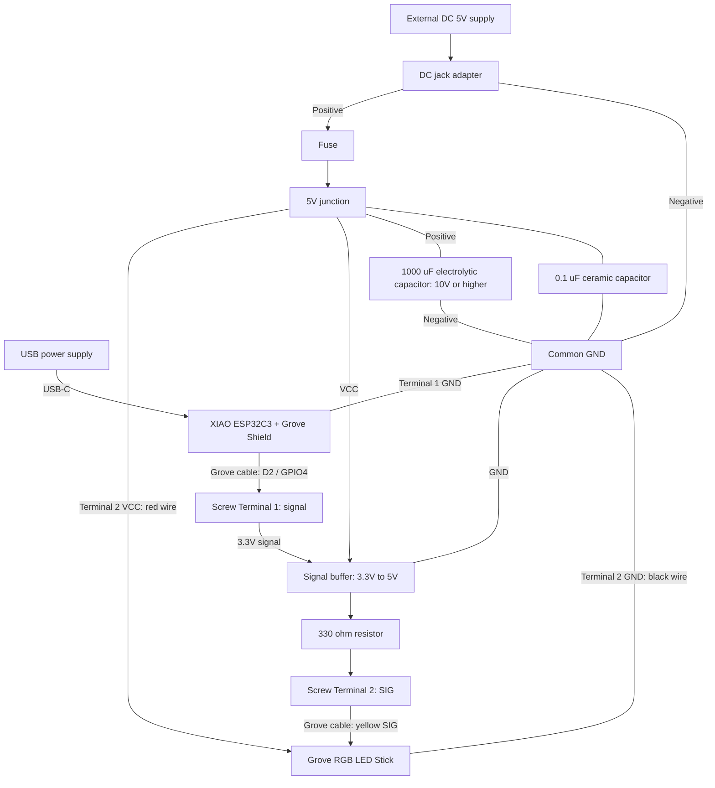

# XIAO ESP32C3 LED Color Preview

[English](README.md) | [Japanese](README.ja.md)

## Overview

Preview physical LED color and brightness against 3DCG lighting using a Grove RGB LED Stick and Arduino IoT Remote. All ten WS2813 Mini LEDs show the same color. This is a planned build: the control sketch is not included and the proposed wiring has not been tested.

## Bill of Materials

### Control System

| Part | Quantity | Role / Notes |
| --- | --- | --- |
| [XIAO ESP32C3 PRE-SOLDERED](https://link.amazon/B0c237jnG) | 1 | Main controller with WiFi; headers pre-soldered |
| [Seeed Studio XIAO Grove Shield](https://jp.seeedstudio.com/Grove-Shield-for-Seeeduino-XIAO-p-4621.html) | 1 | Grove connection interface |

### Input & Output

| Part | Quantity | Role / Notes |
| ---------------------------------------------- | ---- | -------------- |
| [Grove RGB LED Stick 104020131](https://jp.seeedstudio.com/Grove-RGB-LED-Stick-10-WS2813-Mini.html) | 1 | Ten WS2813 Mini LEDs; Grove cable included |

### Power System

| Part | Quantity | Role / Notes |
| ------------------------------------------------------------------------------------------------- | ---- | ---------------------------------------- |
| [Power Supply (5V, 2A+)](https://amzn.to/4jZEIyu) or [Mobile Power Bank](https://amzn.to/45jTQ5W) | 1    | Power supply for LEDs.                   |
| [Grove Screw Terminal](https://link.amazon/B022xHEM0) | 2 | Separate Shield-side and LED-side wiring without cutting cables |
| [DC jack adapter (female)](https://amzn.to/3IdZI7k)                                               | 1    | Connect the AC adapter to the breadboard |
| [Logic Level Shifter](https://amzn.to/4eeDyhr) | 1     | To convert the data signal voltage. |
| [Electrolytic Capacitor (1000µF)](https://amzn.to/45ZOWLQ)                                        | 1    | For power supply stabilization           |

### Prototyping & Wiring

| Part | Quantity | Role / Notes |
| ---------------------------------------------- | ----- | ---------------------------------- |
| [Breadboard](https://amzn.to/40bMzlk)          | 1     | Circuit base (for prototype)       |
| [Jumper Wires](https://amzn.to/45voWYC)        | 1 set | Connecting parts together          |
| [Resistor (300-500Ω)](https://amzn.to/4kMejW2) | 1     | For protecting the LED's data line |
| [USB-C Cable](https://amzn.to/4lU4bdZ)        | 1    | For programming and powering . |

## Development

### Hardware Development

#### Wiring plan

Power XIAO through USB-C and the LED circuit from a separate 5V supply. With all power off, insert the XIAO into the Grove Shield in the correct orientation. Connect Screw Terminal 1 to the Shield's D2/A2 Grove port and verify its primary signal reaches GPIO4. Connect Screw Terminal 2 to the LED through the second Grove cable.

- Terminal 1 signal → 3.3V-to-5V buffer input; buffer output → 330Ω resistor → Terminal 2 SIG → LED yellow SIG.
- External 5V positive → DC jack → optional fuse → 5V junction → buffer VCC and Terminal 2 VCC/LED red wire.
- External supply negative → common GND → Terminal 1/XIAO GND, buffer GND, and Terminal 2/LED black wire.
- Place a 1000µF capacitor rated 10V or higher at the LED input, with positive to 5V and negative to GND. Place 0.1µF decoupling close to buffer VCC/GND unless already included.
- Leave Terminal 1 VCC/unused signal, Terminal 2 NC (white LED wire), and XIAO 5V/3V3 power pins disconnected. Do not join the terminals' VCC connections.

The screw terminals do not shift signal levels. Configure buffer enable pins for the selected component. The diagram describes connections, not physical terminal positions. Check polarity, fastening, and insulation; do not apply 5V to XIAO GPIO or 9V/12V to the LED. Use compatible wire sizes rather than forcing 18AWG wire into Grove terminals.

#### Connection diagram

#### Current and optional protection

The original estimate for full-white LED channels is about 0.48A (10 × 3 × 16mA). Measure total and startup current before choosing wire, terminal, and fuse ratings. Optional protection uses a [Littelfuse 0287001.PXCN](https://www.marutsu.co.jp/pc/i/2563488/) 1A/DC32V ATO fuse and [FHAC0002ZXJ holder](https://www.marutsu.co.jp/pc/i/15761797/). Confirm purchase quantity and suitability before use. Fit the fuse near the DC input before the LED/buffer split, or connect the input directly to the 5V junction if omitted.

### Software Development

#### Board and libraries

Use the `esp32 by Espressif Systems` package, select `XIAO_ESP32C3`, and attach its Wi-Fi antenna. The signal is D2 (GPIO4), not the Nano pin mapping. Required libraries: `ArduinoIoTCloud`, `Adafruit_NeoPixel`, and the core's `WiFi` library.

#### Arduino Cloud plan

Register XIAO ESP32C3 as a third-party ESP32 device, save its Device ID/Secret Key, and configure 2.4GHz Wi-Fi. Confirm registration and connection. Create four Read & Write integer variables, `red`, `green`, `blue`, and `brightness`, and four 0–255 dashboard sliders. Open the dashboard in Arduino IoT Remote for iOS/Android. Internet access and an account plan supporting four variables are required.

Implement a dedicated sketch with RGB and brightness stored separately, LEDs off at startup, and cloud-variable changes applied to all ten LEDs. Verify channel order with separate red/green/blue tests.

### Test

#### Planned tests

Test red, green, blue, and white at low brightness, app control, and brightness 0. Measure current, voltage, and temperature at the intended maximum brightness; verify behavior after power cycling and Wi-Fi reconnection.

## References

### Common guides

- [Arduino development](../../../../docs/arduino-development.md)
- [Credentials](../../../../docs/credentials.md)

- [XIAO ESP32C3 Documentation and Pinout](https://wiki.seeedstudio.com/XIAO_ESP32C3_Getting_Started/)
- [Grove Shield for XIAO](https://wiki.seeedstudio.com/Grove-Shield-for-Seeeduino-XIAO-embedded-battery-management-chip/)
- [Grove RGB LED Stick Specifications and Pinout](https://wiki.seeedstudio.com/Grove-RGB_LED_Stick-10-WS2813_Mini/)
- [Arduino Cloud / IoT Remote](https://cloud.arduino.cc/how-it-works/)
- [Grove-to-Jumper Conversion Cable](https://jp.seeedstudio.com/Grove-4-pin-Female-Jumper-to-Grove-4-pin-Conversion-Cable-5-PCs-per-PAck.html)
- [Grove Screw Terminal](https://wiki.seeedstudio.com/Grove-Screw_Terminal/)

## Author

[Asami.K](https://asami.tokyo/)

