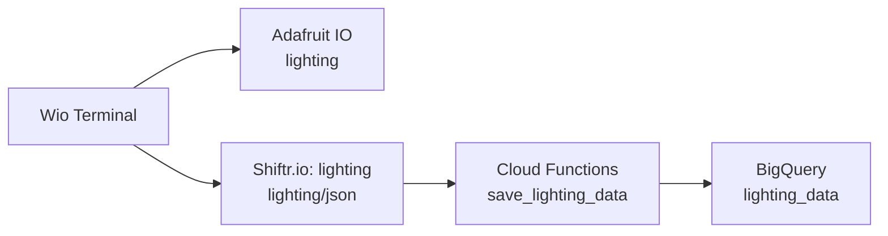

# Wio Terminal 気象ステーション v2 + 照明制御

[English](README.md) | [日本語](README.ja.md)

## 概要

気象ステーション v2 は I2C接続のGrove BME280で温度・湿度・気圧を測定し、予約時刻の赤外線照明制御をWio Terminal 1台に統合します。320×240の横向きLCD（回転設定3）は、既存版の3分割画面とフォントをそのまま使用して温度・湿度・気圧を表示します。照度と照明制御の結果はシリアルモニタで確認します。Adafruit IOと、気象・照明別のShiftr.io / Cloud Functions経由のBigQueryへ送信し、Chassis Battery給電とWi-Fi・MQTT再接続に対応します。

## 部品表

### 制御系

| 部品                                    | 数量 | 用途・備考                                       |
| --------------------------------------- | ---- | ------------------------------------------------ |
| [Wio Terminal](https://amzn.to/4me4lxu) | 1    | 制御部、ディスプレイ、Wi-Fi モジュール。         |
| USB Type-C ケーブル                     | 1    | 給電・書き込み用。データ通信対応ケーブルが必要。 |

### 入出力

| 部品                                                         | 数量 | 用途・備考                         |
| ------------------------------------------------------------ | ---- | ---------------------------------- |
| [Grove BME280 Environmental Sensor](https://amzn.to/4qcfIY1) | 1    | 温度・湿度・気圧を測定（I2C）。    |
| [Grove - Light Sensor v1.2](https://amzn.to/4rsvrTV)         | 1    | 照明フィードバック（10-bit ADC）。 |
| [Grove - Infrared Emitter](https://amzn.to/4rt9Tqi)          | 1    | 照明制御の赤外線を送信。           |
| Grove Infrared Receiver                                      | 1    | 波形学習・受信確認。               |

### 電源系

| 部品                                                                                                           | 数量 | 用途・備考                                |
| -------------------------------------------------------------------------------------------------------------- | ---- | ----------------------------------------- |
| [Wio Terminal Chassis Battery（650mAh）](https://wiki.seeedstudio.com/ja/Wio-Terminal-Chassis-Battery_650mAh/) | 1    | **必須**。照明制御用のGroveポートと給電。 |

### 試作・配線

| 部品               | 数量 | 用途・備考                                                     |
| ------------------ | ---- | -------------------------------------------------------------- |
| 4ピンGroveケーブル | 3    | 照度センサ・赤外線送信器・受信器をChassisのGroveポートに接続。 |

## 開発

### ハードウェア開発

#### 配線

- Wio Terminal
  - Wio Terminal本体にChassis Batteryを装着する。
  - Wio Terminal本体のGrove I2C → BME280（[既存の配線](../Weather_Station_v2/README.ja.md#ハードウェアとファームウェア)）。
- Chassis Battery（[公式ポート配置図](https://files.seeedstudio.com/wiki/Wio-Terminal-Battery-Chassis/img/WT-battery-front.jpg)）
  - **D0/A0（D1/A1と同じポート）** → Grove Light Sensor v1.2。
  - **D2/A2（D3/A3と同じポート）** → Grove Infrared Emitter。
  - **D4/A4（D5/A5と同じポート）** → Grove Infrared Receiver。

### ソフトウェア開発

元のWeather Station v2の気象処理と `Free_Fonts.h` を統合版に引き継ぎ、照明制御と照明専用MQTT接続を [lighting_control.h](sketch/Weather_Station_v2_Smart_Lighting_Control/lighting_control.h) と `config.h` で追加しています。

1. Wio Terminal本体のUSB-Cを、データ通信対応ケーブルでPCにつなぎます。

2. Arduino IDEで [Weather_Station_v2_Smart_Lighting_Control.ino](sketch/Weather_Station_v2_Smart_Lighting_Control/Weather_Station_v2_Smart_Lighting_Control.ino) を開きます。

3. 「ツール」→「ボード」で **Seeed SAMD Boards → Seeeduino Wio Terminal** を選び、「ポート」で接続したWio Terminalのポートを選びます。
   - ボードが表示されない場合は、[Seeed公式のセットアップ手順](https://wiki.seeedstudio.com/Wio-Terminal-Getting-Started/)に従ってSeeed SAMDボードパッケージを追加します。共通の開発手順は[Arduino開発ガイド](../../../../../docs/arduino-development.ja.md)を参照してください。

4. 必要なライブラリをインストールします。
   - ライブラリは既存の `rpcWiFi`・Wio対応 `TFT_eSPI` に加え、`Grove - Barometer Sensor BME280`、`PubSubClient` 2.8、`ArduinoJson` 6または7、`IRremote` 4.5以降を使用します。

5. スケッチと同じフォルダの [credentials.h.example](sketch/Weather_Station_v2_Smart_Lighting_Control/credentials.h.example) を `credentials.h` としてコピーし、Wi-FiとMQTTの認証情報を入力します。
   - `credentials.h` には `WIFI_SSID`、`WIFI_PASSWORD`、`AIO_USERNAME`、`AIO_KEY`、`SHIFTR_KEY`、`SHIFTR_SECRET` を設定します。MQTT接続先・ポートは `AIO_SERVER`・`AIO_SERVERPORT`・`SHIFTR_SERVER`・`SHIFTR_SERVERPORT` で設定します。既存版と同じ形式です（[認証情報の説明](../Weather_Station_v2/README.ja.md#ハードウェアとファームウェア)）。

6. 同じフォルダの [config.h](sketch/Weather_Station_v2_Smart_Lighting_Control/config.h) で、`SCHEDULED_OFF_HOUR` と `SCHEDULED_OFF_MINUTE` を希望の消灯時刻に変更します。初回は `ENABLE_SCHEDULED_IR = false` のままにします。
   - 消灯時刻は日本標準時（JST）です。既定値は23:30で、NTP同期が完了するまで予約消灯は実行しません。

7. Arduino IDEの「書き込み」ボタンを押し、統合スケッチをWio Terminalへ書き込みます。

8. シリアルモニタを **115200 baud** で開き、照度しきい値と赤外線送信を確認します。
   - シリアルモニタの `[Lighting] ADC:` を点灯・消灯時に読み、`config.h` の `LIGHT_OFF_THRESHOLD` と `SCHEDULED_OFF_THRESHOLD` を調整します。値は0〜1023のADC値で、luxではありません。変更後は統合スケッチを再度書き込みます。
   - 予約を無効にした状態で、送信器を照明へ向け、シリアルモニタから `s` を送ります。1回だけON/OFF信号を送信し、2秒後に照度から `OFF verified` / `OFF not verified` を表示します。
   - 現在の波形が照明に合わない場合は、[IR_Learning.ino](sketch/IR_Learning/IR_Learning.ino) を開いて書き込みます。115200 baudのシリアルモニタを開き、リモコンを受信器へ向けてON/OFFボタンを短く押します。出力されたus配列を統合版の `config.h` の `rawDataON_OFF[]` にコピーし、統合スケッチを開き直して書き込みます。配列長は自動計算です。

9. 動作を確認したら、`config.h` の `ENABLE_SCHEDULED_IR` を `true` に変更し、統合スケッチをもう一度書き込みます。
   - 信号はトグル式なので、消灯確認に失敗しても自動再送しません。予約と同じ1分間に再起動すると再判定されます。予約時刻を過ぎて起動した場合、過去の予約は実行しません。既存の通信再接続処理の待機中は、照明判定が遅れる場合があります。

#### クラウド連携

気象側は[既存版のクラウド連携](../Weather_Station_v2/README.ja.md#クラウド連携)を使い、以下の手順で照明データの送信先を追加します。



1. Adafruit IOにログインし、「Feeds」→「New Feed」で **`lighting`** フィードを作成します。
   - フィードのキーが `lighting` になっていることを確認します。気象用の `temperature`・`humidity`・`pressure` は既存のものを使います。[フィード作成の公式手順](https://learn.adafruit.com/adafruit-io-basics-feeds/creating-a-feed)

2. Google CloudのBigQuery画面で、**`diy_electronics_iot.lighting_data`** テーブルを作成します。
   - [照明パイプラインの作成SQL](../../../../../cloud/Cloud_Functions/Smart_Lighting_Control_Data_Pipeline/README.ja.md#データ変換とスキーマ)を実行します。`YOUR_GCP_PROJECT_ID` は自分のGoogle CloudプロジェクトIDに置き換えます。既存の気象用データセットにテーブルを追加できます。

3. PCで [Smart_Lighting_Control_Data_Pipeline](../../../../../cloud/Cloud_Functions/Smart_Lighting_Control_Data_Pipeline) フォルダを開き、照明用関数 **`save_lighting_data`** をデプロイします。
   - 初回のログイン・プロジェクト選択は[Cloud Functions共通手順](../../../../../docs/cloud-functions.ja.md#準備)を参照してください。次のコマンドは照明パイプラインのフォルダで実行します。

     ```sh
     gcloud functions deploy save_lighting_data --gen2 --region asia-northeast1 --runtime python311 --source . --entry-point save_lighting_data --trigger-http --memory 256MB --timeout 60s --allow-unauthenticated
     ```

   - デプロイ後のHTTPトリガーURLを控えます。実行サービスアカウントには対象データセットへのBigQuery書き込み権限を付与し、`LOCAL_TEST_MODE` は未設定または `false` にします。作成済みの関数を使う場合は、そのURLを確認するだけで構いません。

4. Shiftr.ioで、照明用の **`lighting` インスタンス**を開きます。
   - 気象は `weather-station`（Primary Domain: `weedcarpet525.cloud.shiftr.io`）、照明は `lighting`（Primary Domain: `lighting.cloud.shiftr.io`）を使います。表示名ではなくPrimary Domainを接続先に設定します。

5. インスタンスの設定画面で「Webhooks」→「Create Webhook」を開き、照明用webhookを作成します。
   - **Name**：`lighting-to-bigquery`（任意の名前）。
   - **Topic**：`lighting/json`。
   - **URL**：手順3の `save_lighting_data` のHTTPトリガーURL。
   - **Content Type**：`application/json`。
   - **Body**：気象用webhookと同じく、MQTT本文のJSONをそのままHTTP本文として転送する設定にします。`lux`・`light_state`・`device_id` がJSONの最上位に必要です。
   - 設定を保存し、有効になっていることを確認します。`weather-station` 側の気象用webhookは `wio/json` のまま残します。[webhook設定の公式説明](https://www.shiftr.io/docs/cloud/webhooks/)

6. 統合スケッチの `credentials.h` に認証情報を設定し、Wio Terminalへ再度書き込みます。
   - `AIO_USERNAME`・`AIO_KEY` はAdafruit IO用です。気象用の `SHIFTR_SERVER`・`SHIFTR_SERVERPORT`・`SHIFTR_KEY`・`SHIFTR_SECRET` は維持し、照明用に `LIGHTING_SHIFTR_SERVER`・`LIGHTING_SHIFTR_SERVERPORT`・`LIGHTING_SHIFTR_KEY`・`LIGHTING_SHIFTR_SECRET` を設定します。照明のホストは `lighting.cloud.shiftr.io`、ポートは `1883`、認証情報は `lighting` の接続画面の値です。

7. シリアルモニタを115200 baudで開き、`Adafruit IO MQTT connected successfully!`、`Shiftr.io MQTT connected successfully!`、`[Lighting MQTT] connected` を確認して、60秒以上待ちます。
   - Adafruit IOの `lighting` フィードで値と更新時刻を確認します。値は照度センサのADC値（0〜1023）です。
   - Shiftr.ioの `lighting` インスタンスで `lighting/json` の受信を確認し、webhookの送信結果と[関数ログ](../../../../../docs/cloud-functions.ja.md#ログと-webhook-の確認)を確認します。
   - [照明パイプラインの確認SQL](../../../../../cloud/Cloud_Functions/Smart_Lighting_Control_Data_Pipeline/README.ja.md#ローカルデプロイ後のテスト)でBigQueryの保存を確認します。この機器の `device_id` は **`wio_terminal_lighting`** です。

### テスト

- 気象観測・クラウド保存の確認
  - 分析SQLは[既存版のテストと分析](../Weather_Station_v2/README.ja.md#テストと分析)を参照してください。
- 照明制御と障害時の動作確認

## 参考資料

### 共通ガイド

- [Weather Station v2の共通ガイド・参考資料](../Weather_Station_v2/README.ja.md#参考資料)
- [Nano ESP32照明制御](../../../../esp32/Arduino_Nano_ESP32/Smart_Lighting_Control/README.ja.md)
- [照明データパイプライン](../../../../../cloud/Cloud_Functions/Smart_Lighting_Control_Data_Pipeline/README.ja.md)
- [ディレクトリ移行方針](../../../../../.agents/rules/directory-structure.md)

## 作者

[Asami.K](https://asami.tokyo/)

<a href="https://www.buymeacoffee.com/asamiei" target="_blank"></a>
