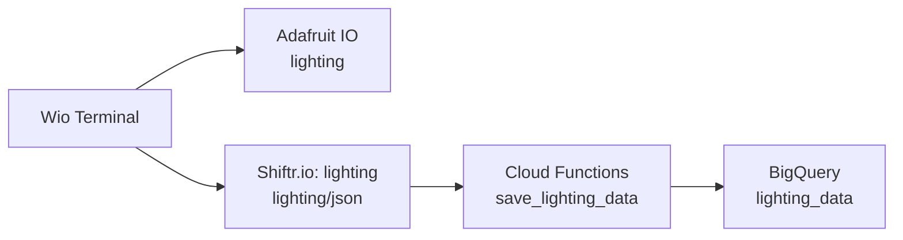

# Wio Terminal Weather Station v2 + Smart Lighting Control

[English](README.md) | [Japanese](README.ja.md)

## Overview

Weather Station v2 measures temperature, humidity, and pressure with an I2C Grove BME280 and integrates scheduled IR lighting control on one Wio Terminal. The landscape 320×240 LCD (rotation 3) retains the original three-section layout and fonts for temperature, humidity, and pressure. Check light readings and lighting results in Serial Monitor. Data is published to Adafruit IO and to BigQuery through separate Shiftr.io/Cloud Functions routes, with Chassis Battery support and Wi-Fi/MQTT reconnection.

## Bill of Materials

### Control System

| Part                                                                                                           | Quantity | Role / Notes                                                                 |
| -------------------------------------------------------------------------------------------------------------- | -------- | ---------------------------------------------------------------------------- |
| [Wio Terminal](https://amzn.to/4me4lxu)                                                                        | 1        | Main controller, display, and Wi-Fi module                                   |
| USB Type-C Cable                                                                                               | 1        | For power and programming. Must be a data-sync cable                         |

### Input & Output

| Part                                                                                                           | Quantity | Role / Notes                                                                 |
| -------------------------------------------------------------------------------------------------------------- | -------- | ---------------------------------------------------------------------------- |
| [Grove BME280 Environmental Sensor](https://amzn.to/4qcfIY1)                                                   | 1        | Measures temperature, humidity, and barometric pressure (I2C) |
| [Grove - Light Sensor v1.2](https://amzn.to/4rsvrTV)                                                           | 1        | Lighting feedback (10-bit ADC)                                               |
| [Grove - Infrared Emitter](https://amzn.to/4rt9Tqi)                                                            | 1        | External transmission and IR learning                                        |
| Grove Infrared Receiver | 1 | Waveform learning and reception diagnostics. |

### Power System

| Part                                                                                                           | Quantity | Role / Notes                                                                 |
| -------------------------------------------------------------------------------------------------------------- | -------- | ---------------------------------------------------------------------------- |
| [Wio Terminal Chassis Battery（650mAh）](https://wiki.seeedstudio.com/Wio-Terminal-Chassis-Battery_650mAh/) | 1        | **Required**: Grove ports for lighting modules and power supply                                   |

### Prototyping & Wiring

| Part                                                                                                           | Quantity | Role / Notes                                                                 |
| -------------------------------------------------------------------------------------------------------------- | -------- | ---------------------------------------------------------------------------- |
| 4-pin Grove cables | 3 | Connect the light sensor, IR emitter, and receiver to Chassis Grove ports. |

## Development

### Hardware Development

#### Wiring

- Wio Terminal
  - Attach the Chassis Battery to the Wio Terminal.
  - Wio Terminal's Grove I2C ? BME280 ([existing wiring](../Weather_Station_v2/README.md#hardware-and-firmware)).
- Chassis Battery ([official port diagram](https://files.seeedstudio.com/wiki/Wio-Terminal-Battery-Chassis/img/WT-battery-front.jpg))
  - **D0/A0 (shared port with D1/A1)** ? Grove Light Sensor v1.2.
  - **D2/A2 (shared port with D3/A3)** ? Grove Infrared Emitter.
  - **D4/A4 (shared port with D5/A5)** ? Grove Infrared Receiver.

### Software Development

The integrated sketch retains the original Weather Station v2 code and `Free_Fonts.h`, adding lighting control and a dedicated lighting MQTT connection through [lighting_control.h](sketch/Weather_Station_v2_Smart_Lighting_Control/lighting_control.h) and `config.h`.

1. Connect the Wio Terminal's USB-C port to your PC with a data-capable cable.

2. In Arduino IDE, open [Weather_Station_v2_Smart_Lighting_Control.ino](sketch/Weather_Station_v2_Smart_Lighting_Control/Weather_Station_v2_Smart_Lighting_Control.ino).

3. Under Tools → Board, select **Seeed SAMD Boards → Seeeduino Wio Terminal**. Under Port, select the connected Wio Terminal.
   - If the board is missing, install the Seeed SAMD board package using the [official setup instructions](https://wiki.seeedstudio.com/Wio-Terminal-Getting-Started/). See the [Arduino development guide](../../../../../docs/arduino-development.md) for common procedures.

4. Install the required libraries.
   - Use existing `rpcWiFi` and Wio-compatible `TFT_eSPI`, plus `Grove - Barometer Sensor BME280`, `PubSubClient` 2.8, `ArduinoJson` 6 or 7, and `IRremote` 4.5 or later.

5. Copy [credentials.h.example](sketch/Weather_Station_v2_Smart_Lighting_Control/credentials.h.example) to `credentials.h` in the same sketch folder and fill in your Wi-Fi and MQTT credentials.
   - Set `WIFI_SSID`, `WIFI_PASSWORD`, `AIO_USERNAME`, `AIO_KEY`, `SHIFTR_KEY`, and `SHIFTR_SECRET` in `credentials.h`. Configure MQTT hosts and ports using `AIO_SERVER`, `AIO_SERVERPORT`, `SHIFTR_SERVER`, and `SHIFTR_SERVERPORT`. The format is shared with the [original credential instructions](../Weather_Station_v2/README.md#hardware-and-firmware).

6. In [config.h](sketch/Weather_Station_v2_Smart_Lighting_Control/config.h), set `SCHEDULED_OFF_HOUR` and `SCHEDULED_OFF_MINUTE` to your desired switch-off time. Keep `ENABLE_SCHEDULED_IR = false` for the first upload.
   - The schedule uses Japan Standard Time (JST), defaulting to 23:30. Scheduled switch-off remains disabled until NTP synchronization completes.

7. Click Upload in Arduino IDE to upload the integrated sketch to the Wio Terminal.

8. Open Serial Monitor at **115200 baud** and check the light thresholds and IR transmission.
   - Compare Serial Monitor `[Lighting] ADC:` values with the light on and off, then adjust `LIGHT_OFF_THRESHOLD` and `SCHEDULED_OFF_THRESHOLD` in `config.h`. Values are 0–1023 ADC readings, not lux. Upload the integrated sketch again after changing them.
   - With scheduling disabled, aim the emitter at the light and send `s` through Serial Monitor. One ON/OFF signal is sent; after two seconds, light feedback reports `OFF verified` or `OFF not verified`.
   - If the existing waveform does not match your light, open and upload [IR_Learning.ino](sketch/IR_Learning/IR_Learning.ino). Open Serial Monitor at 115200 baud, aim the remote at the receiver, and briefly press ON/OFF. Copy the printed microsecond array into `rawDataON_OFF[]` in the integrated sketch's `config.h`, then reopen and upload the integrated sketch. Array length is computed automatically.

9. After verifying operation, change `ENABLE_SCHEDULED_IR` to `true` in `config.h` and upload the integrated sketch again.
   - The signal toggles power, so failed switch-off feedback never triggers an automatic resend. Rebooting during the scheduled minute permits another evaluation. A boot after that minute does not execute a missed schedule. Lighting checks can be delayed while the original network reconnection code waits.

#### Cloud integration

Keep the [existing weather integration](../Weather_Station_v2/README.md#cloud-integration) and follow these steps to add lighting destinations.



1. Sign in to Adafruit IO and select Feeds → New Feed to create **`lighting`**.
   - Check that its feed key is `lighting`. Reuse the existing `temperature`, `humidity`, and `pressure` feeds. [Official feed creation instructions](https://learn.adafruit.com/adafruit-io-basics-feeds/creating-a-feed)

2. In Google Cloud BigQuery, create the **`diy_electronics_iot.lighting_data`** table.
   - Run the [lighting pipeline schema SQL](../../../../../cloud/Cloud_Functions/Smart_Lighting_Control_Data_Pipeline/README.md#data-mapping-and-schema), replacing `YOUR_GCP_PROJECT_ID` with your project ID. Add the table to the existing weather dataset.

3. On your PC, open the [Smart_Lighting_Control_Data_Pipeline](../../../../../cloud/Cloud_Functions/Smart_Lighting_Control_Data_Pipeline) folder and deploy **`save_lighting_data`**.
   - Follow the [common preparation instructions](../../../../../docs/cloud-functions.md) for login and project selection, then run this command from the lighting pipeline folder.

     ```sh
     gcloud functions deploy save_lighting_data --gen2 --region asia-northeast1 --runtime python311 --source . --entry-point save_lighting_data --trigger-http --memory 256MB --timeout 60s --allow-unauthenticated
     ```
   - Save the HTTP trigger URL. Grant the runtime service account BigQuery write access to the target dataset, and leave `LOCAL_TEST_MODE` unset or set it to `false`. If the function already exists, retrieve its URL instead of deploying again.

4. In Shiftr.io, open the dedicated **`lighting` instance**.
   - Weather uses `weather-station` (Primary Domain: `weedcarpet525.cloud.shiftr.io`); lighting uses `lighting` (Primary Domain: `lighting.cloud.shiftr.io`). Configure the Primary Domain as the MQTT host, rather than assuming it matches the display name.

5. Open the instance settings, select Webhooks → Create Webhook, and create a lighting webhook.
   - **Name**: `lighting-to-bigquery` (any descriptive name).
   - **Topic**: `lighting/json`.
   - **URL**: the `save_lighting_data` HTTP trigger URL from step 3.
   - **Content Type**: `application/json`.
   - **Body**: use the same raw MQTT JSON forwarding template as the weather webhook. The HTTP JSON must contain `lux`, `light_state`, and `device_id` at its top level.
   - Save and verify that the webhook is enabled. Keep the weather webhook on `weather-station` subscribed to `wio/json`. [Official webhook settings](https://www.shiftr.io/docs/cloud/webhooks/)

6. Update the integrated sketch's `credentials.h` and upload the sketch to the Wio Terminal again.
   - Use `AIO_USERNAME` and `AIO_KEY` for Adafruit IO. Preserve weather settings `SHIFTR_SERVER`, `SHIFTR_SERVERPORT`, `SHIFTR_KEY`, and `SHIFTR_SECRET`. Add `LIGHTING_SHIFTR_SERVER`, `LIGHTING_SHIFTR_SERVERPORT`, `LIGHTING_SHIFTR_KEY`, and `LIGHTING_SHIFTR_SECRET` for lighting: host `lighting.cloud.shiftr.io`, port `1883`, and credentials from the lighting instance connection settings.

7. Open Serial Monitor at 115200 baud, check for `Adafruit IO MQTT connected successfully!`, `Shiftr.io MQTT connected successfully!`, and `[Lighting MQTT] connected`, and wait at least 60 seconds.
   - Check values and update times in the Adafruit IO `lighting` feed. Values are light sensor ADC readings (0–1023).
   - Check reception on the Shiftr.io `lighting` instance topic `lighting/json`, webhook results, and [function logs](../../../../../docs/cloud-functions.md).
   - Use the [lighting pipeline verification SQL](../../../../../cloud/Cloud_Functions/Smart_Lighting_Control_Data_Pipeline/README.md#local-and-deployed-tests) to check BigQuery rows. This device's `device_id` is **`wio_terminal_lighting`**.

### Test

- Check weather readings and cloud storage.
  - See the [original test and analysis](../Weather_Station_v2/README.md#test-and-analysis) for analysis SQL.
- Check lighting control and behavior during failures.

## References

### Common guides

- [Weather Station v2 common guides and references](../Weather_Station_v2/README.md#references)
- [Nano ESP32 lighting control](../../../../esp32/Arduino_Nano_ESP32/Smart_Lighting_Control/README.md)
- [Lighting data pipeline](../../../../../cloud/Cloud_Functions/Smart_Lighting_Control_Data_Pipeline/README.md)
- [Directory migration policy](../../../../../.agents/rules/directory-structure.md)

## Author

[Asami.K](https://asami.tokyo/)

<a href="https://www.buymeacoffee.com/asamiei" target="_blank"></a>
